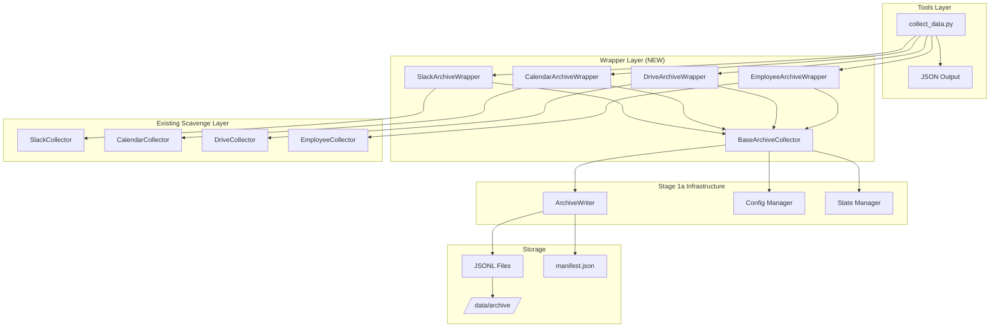

# Tasks Implementation Details (Archived)

*This file contains detailed implementation specifications that were moved from tasks.md to reduce context window usage.*

## Task 1a.1: Environment & Dependencies Setup

**Test Acceptance Criteria:**
```python
# tests/unit/test_dependencies.py
def test_all_base_requirements_importable():
    """All packages in requirements/base.txt can be imported successfully"""
    # ACCEPTANCE: Zero import errors for any base dependency
    
def test_dev_requirements_importable():
    """All development tools can be imported"""
    # ACCEPTANCE: black, mypy, coverage, pytest all importable
    
def test_env_example_completeness():
    """Template .env.example has all required variables"""
    required_vars = ['AICOS_BASE_DIR', 'SLACK_BOT_TOKEN', 'GOOGLE_CLIENT_ID', ...]
    # ACCEPTANCE: Every required variable present with example values

def test_requirements_no_version_conflicts():
    """No conflicting package versions"""
    # ACCEPTANCE: pip-compile runs without conflicts
```

**Implementation Tasks:**
- Create requirements/base.txt with Google APIs, Slack SDK, FastAPI
- Create requirements/dev.txt with testing tools (black, mypy, coverage)
- Create .env.example template
- Update main requirements.txt

**Definition of Done:**
- ✅ All tests pass
- ✅ Requirements install without conflicts
- ✅ .env.example has all 15+ required variables

### Task 1a.2: Configuration Management

**Test Acceptance Criteria:**
```python
# tests/unit/test_config.py
def test_config_loads_from_aicos_base_dir():
    """Config correctly reads AICOS_BASE_DIR environment variable"""
    # ACCEPTANCE: Config.base_dir equals os.getenv('AICOS_BASE_DIR')
    
def test_config_validates_all_paths():
    """All configured paths must exist and be writable"""
    # ACCEPTANCE: Raises ConfigError for non-existent or read-only paths
    
def test_config_validates_credentials():
    """All API credentials are tested for validity"""  
    # ACCEPTANCE: Makes actual test calls to Slack/Google APIs
    
def test_config_validates_disk_space():
    """Minimum 10GB disk space required"""
    # ACCEPTANCE: Raises ConfigError if <10GB available
    
def test_config_fail_fast_on_errors():
    """Configuration errors prevent system startup"""
    # ACCEPTANCE: System exits with code 1 on any config error
```

**Implementation Tasks:**
- Implement src/core/config.py with AICOS_BASE_DIR validation
- Add credential testing for all APIs
- Add disk space validation
- Fail-fast on configuration errors

**Definition of Done:**
- ✅ All tests pass
- ✅ Config validates 100% of required settings
- ✅ Startup fails immediately on any missing/invalid configuration

### Task 1a.3: Atomic State Management

**Test Acceptance Criteria:**
```python
# tests/unit/test_state.py
def test_state_write_is_atomic():
    """State writes use temp file + rename for atomicity"""
    # ACCEPTANCE: Interrupted writes never leave partial files
    
def test_concurrent_state_access_safe():
    """Multiple processes can safely read/write state"""
    # ACCEPTANCE: 10 concurrent writers, zero corruption
    
def test_state_corruption_recovery():
    """Corrupted state files are detected and recovered"""
    # ACCEPTANCE: Auto-restores from backup, logs warning
    
def test_state_backup_before_modify():
    """All modifications create backup first"""
    # ACCEPTANCE: .backup file exists before any write operation
    
def test_file_locking_prevents_conflicts():
    """File locking prevents concurrent access issues"""
    # ACCEPTANCE: Second process waits for lock, no data loss
```

**Implementation Tasks:**
- Implement src/core/state.py using temp file + rename pattern
- Add file locking for concurrent access
- Add corruption recovery mechanisms
- Backup before modifications

**Definition of Done:**
- ✅ All tests pass
- ✅ Zero data loss under any failure scenario
- ✅ Concurrent access stress test passes (10 processes)

### Task 1a.4: Archive Writer Foundation

**Test Acceptance Criteria:**
```python
# tests/unit/test_archive_writer.py
def test_jsonl_append_is_atomic():
    """JSONL append operations are atomic"""
    # ACCEPTANCE: Process interruption never leaves partial lines
    
def test_daily_directories_auto_created():
    """Daily archive directories created automatically"""
    # ACCEPTANCE: /data/archive/slack/YYYY-MM-DD/ exists after first write
    
def test_write_performance_target():
    """Archive writer meets performance target"""
    # ACCEPTANCE: Sustained 10,000 records/second write speed
    
def test_metadata_tracking_accurate():
    """Metadata correctly tracks file sizes, counts, timestamps"""
    # ACCEPTANCE: manifest.json matches actual file contents
    
def test_thread_safe_operations():
    """Multiple threads can write safely"""
    # ACCEPTANCE: 5 threads writing simultaneously, zero corruption
```

**Implementation Tasks:**
- Implement src/core/archive_writer.py for JSONL operations
- Thread-safe append operations
- Daily directory creation
- Metadata tracking

**Definition of Done:**
- ✅ All tests pass
- ✅ Performance benchmark achieved (10K writes/sec)
- ✅ Thread safety verified under stress

### Task 1a.5: Testing Infrastructure

**Test Acceptance Criteria:**
```python
# tests/unit/test_testing_infrastructure.py
def test_mock_data_is_deterministic():
    """Mock fixtures return consistent data"""
    # ACCEPTANCE: Same input always produces identical output
    
def test_coverage_reports_generated():
    """Code coverage reports generated successfully"""
    # ACCEPTANCE: HTML report shows >=90% coverage
    
def test_external_apis_mocked():
    """No real API calls in unit tests"""
    # ACCEPTANCE: Zero network requests during test run
    
def test_pytest_configuration_works():
    """Pytest configuration loads and runs tests"""
    # ACCEPTANCE: All test discovery and execution works
```

**Implementation Tasks:**
- Create comprehensive test files
- Set up pytest configuration
- Mock external dependencies
- Achieve 90% coverage

**Definition of Done:**
- ✅ All tests pass
- ✅ 90% code coverage achieved
- ✅ Zero external API calls in tests
- ✅ Deterministic test execution

---

## Plan: Stage 1b - Collector Wrappers Implementation
Date: 2025-08-15
**Owner**: Agent 2 (Collector Integration)
**Duration**: Day 1 Afternoon (4 hours)
**Dependencies**: Stage 1a must be complete

## Executive Summary
Create wrapper classes that integrate existing scavenge/ collectors with the new archive system from Stage 1a. These wrappers will transform collector output into JSONL format and write to daily archive directories while preserving 100% of existing functionality. This stage can be executed in parallel after Stage 1a completes.

## Architecture Overview



## Implementation Approach

### Phase 1: Test Infrastructure & Base Collector (1 hour)
**Objectives:**
- Set up comprehensive test infrastructure with fixtures
- Create abstract base collector with standard interface
- Establish error handling and retry patterns

**Deliverables:**
- BaseArchiveCollector abstract class
- Mock data fixtures for all collectors
- Test utilities and helpers
- Error handling framework

### Phase 2: Slack Wrapper Implementation (1.5 hours)
**Objectives:**
- Wrap existing SlackCollector with archive integration
- Transform Slack data to JSONL format
- Preserve threading, reactions, and all metadata
- Implement rate limiting pass-through

**Deliverables:**
- SlackArchiveWrapper class
- JSONL transformation for messages, channels, users
- Thread relationship preservation
- Daily snapshot generation

### Phase 3: Calendar & Employee Wrappers (1 hour)
**Objectives:**
- Implement CalendarArchiveWrapper with timezone handling
- Create EmployeeArchiveWrapper with ID mapping
- Ensure consistent data formats across wrappers
- Handle change detection and deltas

**Deliverables:**
- CalendarArchiveWrapper with UTC normalization
- EmployeeArchiveWrapper with complete ID mapping
- Change tracking mechanisms
- Attendee and RSVP preservation

### Phase 4: Drive Wrapper & Orchestrator (30 minutes)
**Objectives:**
- Create metadata-only Drive wrapper
- Build collection orchestrator tool
- Implement JSON output formatting
- Handle partial failures gracefully

**Deliverables:**
- DriveArchiveWrapper (metadata only)
- tools/collect_data.py orchestrator
- Structured JSON output
- Error aggregation and reporting

### Relevant Files for Stage 1b: Collector Wrappers

**Read for Context:**
- `scavenge/src/collectors/slack.py` - Existing Slack collector implementation (full file)
- `scavenge/src/collectors/calendar.py` - Calendar collector patterns
- `scavenge/src/collectors/employees.py` - Employee collection logic  
- `scavenge/main.py` - How collectors are currently invoked (lines 48-120)
- `src/core/archive_writer.py` - NEW - Archive writer interface (from Stage 1a)
- `src/core/config.py` - NEW - Configuration management (from Stage 1a)

**Files to Create:**
- `src/collectors/base.py` - BaseArchiveCollector abstract class
- `src/collectors/slack.py` - SlackArchiveWrapper 
- `src/collectors/calendar.py` - CalendarArchiveWrapper
- `src/collectors/drive.py` - DriveArchiveWrapper  
- `src/collectors/employees.py` - EmployeeArchiveWrapper
- `src/collectors/circuit_breaker.py` - Circuit breaker implementation
- `tools/collect_data.py` - New collection orchestrator

**Files to Modify:**
- None (wrappers call existing scavenge collectors)

**Reference Patterns:**
- `scavenge/src/collectors/slack.py:19-50` - SlackRateLimiter implementation
- `scavenge/main.py:87-120` - Existing collector invocation pattern
- `scavenge/src/core/system_state_manager.py:60-75` - State tracking approach

**Test Files to Create:**
- `tests/integration/test_collector_wrappers.py` - End-to-end wrapper tests
- `tests/unit/test_base_collector.py` - Base collector tests
- `tests/fixtures/mock_slack_data.py` - Mock collector responses
- `tests/fixtures/mock_calendar_data.py` - Calendar test data
- `tests/fixtures/mock_employee_data.py` - Employee roster mocks
- `tests/fixtures/mock_drive_data.py` - Drive metadata mocks
- `tests/helpers/collector_helpers.py` - Test utilities

[Content continues with detailed test specifications and implementation details...]