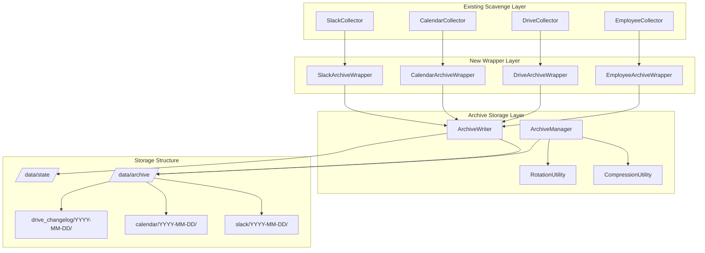

# Plan: Stage 1 - Storage & Archive Foundation
Date: 2025-08-15

## Executive Summary
Establish a comprehensive archive storage system by creating collector wrappers that redirect existing scavenge/ collectors to write append-only JSONL files in daily archive directories. This foundation ensures complete data preservation, supports historical queries, and provides utilities for compression and rotation while maintaining immutability.

## Architecture Overview



## Implementation Approach

### Task 1: Create Base Archive Infrastructure
**Files to create:**
- `src/core/archive_writer.py` - Atomic JSONL writer with append-only operations
- `src/core/archive_manager.py` - Archive management utilities
- `src/core/compression.py` - Compression utilities for older data

**Key features:**
- Atomic writes using temp file + rename pattern
- File locking for concurrent access safety
- Automatic daily directory creation
- Metadata tracking (size, count, last_written)

### Task 2: Implement Collector Base Wrapper
**Files to create:**
- `src/collectors/base.py` - BaseArchiveCollector abstract class

**Key features:**
- Standardized interface for all collectors
- Automatic archive path resolution
- Error handling and retry logic
- State persistence integration

### Task 3: Create Slack Archive Wrapper
**Files to create:**
- `src/collectors/slack.py` - SlackArchiveWrapper

**Implementation:**
```python
class SlackArchiveWrapper(BaseArchiveCollector):
    def __init__(self):
        self.scavenge_collector = ScavengeSlackCollector()
        self.archive_writer = ArchiveWriter('slack')
    
    def collect_and_archive(self):
        # 1. Call scavenge collector
        # 2. Transform to JSONL records
        # 3. Write to archive with metadata
        # 4. Update state
```

**Data format:**
- Messages: One JSONL line per message with full context
- Channels: Daily snapshot in channels.json
- Users: Daily snapshot in users.json

### Task 4: Create Calendar Archive Wrapper
**Files to create:**
- `src/collectors/calendar.py` - CalendarArchiveWrapper

**Data format:**
- Events: One JSONL line per event with attendees
- Calendars: Daily snapshot of calendar metadata
- Changes: Delta tracking for modified/cancelled events

### Task 5: Create Drive Archive Wrapper
**Files to create:**
- `src/collectors/drive.py` - DriveArchiveWrapper

**Data format:**
- Changes: One JSONL line per file activity
- Metadata only (no file contents)
- Permission changes tracked

### Task 6: Create Employee Archive Wrapper
**Files to create:**
- `src/collectors/employees.py` - EmployeeArchiveWrapper

**Data format:**
- Roster: Daily snapshot in roster.json
- Changes: Delta tracking in changes.jsonl

### Task 7: Implement Archive Writer
**Key methods:**
```python
def append_jsonl(self, data: Dict, file_suffix: str = "data")
def write_snapshot(self, data: Dict, filename: str)
def ensure_daily_directory(self) -> Path
def get_archive_path(self, source: str, date: str) -> Path
def atomic_write(self, path: Path, data: str)
```

**Features:**
- Thread-safe file operations
- Automatic retry on failures
- Corruption detection and recovery
- Metadata tracking in manifest.json

### Task 8: Implement Archive Manager
**Key methods:**
```python
def compress_old_archives(self, days_old: int = 30)
def rotate_archives(self, retention_days: int = 365)
def get_archive_stats(self) -> Dict
def verify_archive_integrity(self, date: str) -> bool
def backup_archive(self, source: str, date: str)
```

### Task 9: Create Collection Orchestrator
**Files to create:**
- `tools/collect_data.py` - New collection tool using archive wrappers

**Features:**
- Calls appropriate wrapper based on source
- Returns standardized JSON output
- Handles errors gracefully
- Updates state atomically

### Task 10: Implement State Management
**Files to enhance:**
- `src/core/state.py` - Enhanced state management for archives

**New features:**
- Archive metadata tracking
- Collection statistics
- Cursor management per source
- Last successful write timestamps

### Task 11: Add Compression Utilities
**Implementation details:**
- Use gzip for JSONL files older than 30 days
- Maintain index files for compressed data
- Support transparent decompression for queries
- Keep metadata uncompressed for fast access

### Task 12: Add Rotation Utilities
**Implementation details:**
- Move data older than 365 days to cold storage
- Maintain yearly summary files
- Create deletion manifests (never actually delete)
- Support restoration from cold storage

### Task 13: Create Archive Verification
**Files to create:**
- `tools/verify_archive.py` - Archive integrity checker

**Checks:**
- JSONL format validity
- Manifest consistency
- No data gaps
- Compression integrity

### Task 14: Write Integration Tests
**Files to create:**
- `tests/integration/test_archive_collection.py`
- `tests/integration/test_archive_management.py`

**Test scenarios:**
- Concurrent writes
- Compression/decompression
- State persistence
- Error recovery
- Data integrity

### Task 15: Create Setup Script
**Files to update:**
- `scripts/migrate_scavenge.sh` - Migration script for existing data

**Features:**
- Migrate existing scavenge/data to new archive
- Preserve timestamps and metadata
- Verify migration completeness
- Create backup before migration

## User and System Workflows

### Daily Collection Workflow
1. Cron/scheduler triggers `tools/collect_data.py --source all`
2. Tool initializes appropriate archive wrappers
3. Each wrapper:
   - Calls scavenge collector
   - Transforms data to archive format
   - Writes to daily archive directory
   - Updates state and manifests
4. Returns JSON summary of collection

### Archive Management Workflow
1. Nightly job runs `tools/manage_archives.py`
2. Compresses archives older than 30 days
3. Rotates archives older than 365 days
4. Updates manifests and indices
5. Sends summary report

### Query Workflow (for future stages)
1. Query engine determines date range
2. Checks manifest for file locations
3. Decompresses if needed (transparent)
4. Reads JSONL lines efficiently
5. Returns results with source references

## Testing Strategy

### Unit Tests
- Archive writer atomic operations
- Compression/decompression accuracy
- State management consistency
- Path resolution logic

### Integration Tests
- End-to-end collection to archive
- Concurrent write handling
- Recovery from interruption
- Migration from existing data

### Performance Tests
- Write throughput (target: 10K records/second)
- Compression ratio (target: 70% reduction)
- Query response time (target: <100ms for date lookup)

### User Acceptance Criteria
- All collectors write to archive successfully
- No data loss during collection
- Archives queryable by date
- Compression reduces storage by >50%
- State persists across restarts

## Implementation Order
1. **Day 1 Morning**: Tasks 1-2 (Base infrastructure)
2. **Day 1 Afternoon**: Tasks 3-6 (Collector wrappers)
3. **Day 1 Evening**: Tasks 7-8 (Archive writer/manager)
4. **Day 2 Morning**: Tasks 9-10 (Orchestration and state)
5. **Day 2 Afternoon**: Tasks 11-12 (Compression/rotation)
6. **Day 2 Evening**: Tasks 13-15 (Verification and migration)

## Success Metrics
- ✅ All 4 collectors writing to archive
- ✅ JSONL format with one record per line
- ✅ Daily directories created automatically
- ✅ Atomic writes prevent corruption
- ✅ State tracks all operations
- ✅ Compression works for old data
- ✅ Tests pass with >90% coverage
- ✅ Migration completes without data loss

## Risk Mitigation
- **Disk space**: Implement compression early, monitor usage
- **Corruption**: Use atomic writes, maintain checksums
- **Performance**: Buffer writes, use async where possible
- **Migration errors**: Create full backup first, verify counts

## Dependencies
- Existing scavenge/ collectors (already available)
- Python standard library (json, gzip, pathlib)
- No external dependencies needed for Stage 1

## Definition of Done
- [ ] All collectors write to /data/archive/ structure
- [ ] JSONL files are append-only and immutable
- [ ] Daily directories created automatically
- [ ] Compression works for 30+ day old data
- [ ] State persists and recovers correctly
- [ ] All tests pass
- [ ] Migration script tested and documented
- [ ] Archive verification tool works
- [ ] Documentation updated

## Notes
- Archive structure prioritizes immutability and auditability
- JSONL format enables streaming reads for large datasets
- Daily directories balance granularity with manageability
- Compression is transparent to consumers
- State management ensures no data loss

## Implementation Checklist (Plan → Test → Code → Verify → Regroup)

### Phase 1: Planning & Test Definition (Hour 1-2)
- [ ] Review scavenge/ patterns to extract (not copy)
- [ ] Document acceptance criteria for each component
- [ ] Create test file structure
- [ ] Define JSON schemas for data contracts

### Phase 2: Write Tests with Acceptance Criteria (Hour 3-4)

#### Config System Tests
- [ ] `tests/unit/test_config.py`
  - [ ] Test AICOS_BASE_DIR environment variable reading
  - [ ] Test path validation (all paths exist and writable)
  - [ ] Test disk space validation (minimum 10GB)
  - [ ] Test credential validation
  - [ ] Test fail-fast on configuration errors
  - **Acceptance**: Config loads from env, validates all resources, fails fast on issues

#### Archive Manager Tests  
- [ ] `tests/unit/test_archive_manager.py`
  - [ ] Test JSONL append operations
  - [ ] Test hot storage (0-90 days uncompressed)
  - [ ] Test cold storage compression (91+ days gzipped)
  - [ ] Test transparent read across hot/cold boundary
  - [ ] Test manifest updates
  - **Acceptance**: Data correctly stored/retrieved, compression automatic at 90 days

#### State Manager Tests
- [ ] `tests/unit/test_state_manager.py`
  - [ ] Test atomic write with temp file
  - [ ] Test concurrent access with file locking
  - [ ] Test corruption recovery
  - [ ] Test backup before modification
  - **Acceptance**: No data loss on crash, concurrent writes safe

#### Circuit Breaker Tests
- [ ] `tests/unit/test_circuit_breaker.py`
  - [ ] Test closed state (normal operation)
  - [ ] Test open state after threshold failures
  - [ ] Test half-open state during recovery
  - [ ] Test auto-recovery after timeout
  - **Acceptance**: Prevents cascade failures, auto-recovers

#### Checkpoint Manager Tests
- [ ] `tests/unit/test_checkpoint_manager.py`
  - [ ] Test checkpoint save with state
  - [ ] Test checkpoint load for resume
  - [ ] Test checkpoint cleanup after success
  - [ ] Test multiple concurrent operations
  - **Acceptance**: Operations resume from exact point of interruption

#### Integration Tests
- [ ] `tests/integration/test_stage1_integration.py`
  - [ ] Test complete configuration and startup flow
  - [ ] Test end-to-end archive write with compression
  - [ ] Test checkpoint/resume after simulated failure
  - [ ] Test circuit breaker protecting API calls
  - **Acceptance**: Full pipeline works with all components integrated

### Phase 3: Code Implementation (Hour 5-12)

#### Core Infrastructure
- [ ] Create `src/core/__init__.py` with module exports
- [ ] Implement `src/core/config.py`
  - [ ] Config class with AICOS_BASE_DIR
  - [ ] Validation methods for paths, disk, credentials
  - [ ] Fail-fast startup validation
- [ ] Implement `src/core/archive_manager.py`
  - [ ] ArchiveManager with hot/cold storage logic
  - [ ] Daily JSONL file management
  - [ ] Compression for 90+ day old files
  - [ ] Transparent read across storage tiers
- [ ] Implement `src/core/state.py`
  - [ ] StateManager with atomic operations
  - [ ] Temp file + rename pattern
  - [ ] File locking mechanism
  - [ ] Automatic backup logic
- [ ] Implement `src/core/circuit_breaker.py`
  - [ ] CircuitBreaker with configurable thresholds
  - [ ] State machine (closed/open/half-open)
  - [ ] Failure tracking and recovery timeout
- [ ] Implement `src/core/checkpoint.py`
  - [ ] CheckpointManager for resumable operations
  - [ ] Save/load checkpoint state
  - [ ] Cleanup after completion
- [ ] Implement `src/core/rate_limiter.py`
  - [ ] RateLimiter with jitter (pattern from scavenge)
  - [ ] Configurable requests per second
  - [ ] Method-aware limits
- [ ] Implement `src/core/rules.py`
  - [ ] CollectionRules engine (pattern from scavenge)
  - [ ] Include/exclude patterns
  - [ ] Must-include overrides
- [ ] Implement `src/core/archive_writer.py`
  - [ ] Thread-safe JSONL append
  - [ ] Daily snapshot writing
  - [ ] Integration with ArchiveManager
- [ ] Implement `src/core/manifest.py`
  - [ ] Manifest tracking for archives
  - [ ] Metadata: location, counts, compression status
  - [ ] Query methods for date ranges
- [ ] Implement `src/core/recovery.py`
  - [ ] Exponential backoff retry logic
  - [ ] Safe operation wrappers
- [ ] Implement `src/core/disk_manager.py`
  - [ ] Available space checking
  - [ ] Storage estimation
- [ ] Implement `src/core/auth_validator.py`
  - [ ] Credential testing for all services
  - [ ] Detailed status reporting

#### Collectors Base
- [ ] Implement `src/collectors/base.py`
  - [ ] BaseCollector abstract class
  - [ ] Integration with rate limiter
  - [ ] Integration with circuit breaker
  - [ ] Integration with checkpoint manager
  - [ ] Abstract collect() method

#### Scripts
- [ ] Create `scripts/setup_dirs.py`
  - [ ] Directory structure creation
  - [ ] Permission setting
  - [ ] Initial manifest creation

### Phase 4: Test Execution & Verification (Hour 13-14)

#### Run Unit Tests
- [ ] Run `pytest tests/unit/test_config.py -v`
  - [ ] All config tests pass
  - [ ] Coverage >95% for config.py
- [ ] Run `pytest tests/unit/test_archive_manager.py -v`
  - [ ] All archive tests pass
  - [ ] Hot/cold storage works correctly
- [ ] Run `pytest tests/unit/test_state_manager.py -v`
  - [ ] Atomic operations verified
  - [ ] Concurrent access safe
- [ ] Run `pytest tests/unit/test_circuit_breaker.py -v`
  - [ ] State transitions work
  - [ ] Recovery functions properly
- [ ] Run `pytest tests/unit/test_checkpoint_manager.py -v`
  - [ ] Checkpoints save/load correctly
  - [ ] Resume works from interruption

#### Run Integration Tests
- [ ] Run `pytest tests/integration/test_stage1_integration.py -v`
  - [ ] Complete flow works end-to-end
  - [ ] All components integrate properly
  - [ ] Error scenarios handled gracefully

#### Performance Verification
- [ ] Benchmark archive write speed (target: 10K records/sec)
- [ ] Measure compression ratio (target: 70% reduction)
- [ ] Test checkpoint overhead (target: <5% impact)

#### Code Quality Checks
- [ ] Run `black src/` for formatting
- [ ] Run `flake8 src/` for linting
- [ ] Run `mypy src/` for type checking
- [ ] Generate coverage report `pytest --cov=src --cov-report=html`

### Phase 5: Regroup & Documentation (Hour 15-16)

#### Review & Refactor
- [ ] Review all test results
- [ ] Identify any failed tests or low coverage areas
- [ ] Refactor code based on test feedback
- [ ] Ensure all acceptance criteria met

#### Documentation
- [ ] Update module docstrings
- [ ] Create README for src/core/
- [ ] Document configuration requirements
- [ ] Create example .env.example file
- [ ] Update main project README

#### Prepare for Next Stage
- [ ] Create issues for Stage 2 tasks
- [ ] Document lessons learned
- [ ] Note any technical debt
- [ ] Update plan.md with completion status

## Verification Checklist

### Acceptance Criteria Verification
- [ ] **Config System**: Loads from AICOS_BASE_DIR, validates everything at startup
- [ ] **Archive Storage**: 90-day hot storage works, compression automatic
- [ ] **State Management**: Atomic operations prevent data loss
- [ ] **Circuit Breaker**: Protects against API failures, auto-recovers
- [ ] **Checkpoints**: Long operations can resume from interruption
- [ ] **Rate Limiting**: Prevents API exhaustion with jitter
- [ ] **Collection Rules**: Include/exclude patterns work correctly

### Quality Gates
- [ ] All unit tests pass (100% pass rate)
- [ ] Integration tests pass (100% pass rate)
- [ ] Code coverage >90% for core modules
- [ ] No critical linting issues
- [ ] Type checking passes
- [ ] Performance benchmarks met

### Deliverables
- [ ] Working configuration system with environment variables
- [ ] Archive storage with hot/cold tiers
- [ ] Atomic state management
- [ ] Circuit breaker implementation
- [ ] Checkpoint/resume system
- [ ] All tests passing
- [ ] Complete documentation

## Implementation Notes
- Start with tests first (TDD approach)
- Each test should have clear acceptance criteria
- Code only what's needed to pass tests
- Refactor after tests pass
- Document as you go
- Commit frequently with clear messages