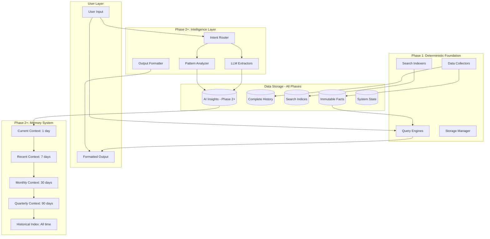

# Progress.md - AI Chief of Staff Implementation Plan

The purpose of this file is to keep track of the overall progress and master plan of the project.

> **Note**: Task plans have been split into separate files for better context management during parallel development. See subsegmentation note at the end of this document.

## Project Overview

**Goal**: Build a comprehensive AI-powered personal assistant that maintains organizational context, tracks informal commitments, and coordinates action for remote leadership teams.

**Core Architecture**: Progressive enhancement model where Phase 1 establishes deterministic data foundation, then Phases 2+ add LLM intelligence to achieve full vision. LLM acts as intelligent layer over deterministic tools that process all data and maintain complete audit trails.

**Success Criteria**:
- 14 consecutive days of daily usage
- Reduce context hunting from 30-60min to ≤10min/day
- Track ≥80% of meeting commitments
- ≥3 meetings/week scheduled via bot
- Zero hallucinated facts (all data traceable to source)

## Architectural Paradigm

### Progressive Enhancement Strategy

The system is built in explicit phases:

**Phase 1 - Deterministic Foundation**:
- Complete data collection and storage
- Full-text search and indexing
- Basic calendar coordination
- Time-based queries and retrieval
- Structured extraction (dates, @mentions, tags)

**Phase 2+ - Intelligence Layers**:
- LLM-powered commitment extraction
- Goal tracking and status inference
- Intelligent briefing generation
- Sentiment analysis and urgency detection
- Predictive nudging and recommendations

### Core Principle: Deterministic Foundation, Intelligent Enhancement

Phase 1 establishes trust through:
1. **Complete Collection**: Capture all data deterministically
2. **Perfect Recall**: Every piece of data searchable and retrievable
3. **Transparent Operations**: All operations explainable without AI
4. **Immediate Value**: Solve context hunting without magic

Phases 2+ add intelligence with:
1. **Semantic Understanding**: Extract meaning from natural language
2. **Pattern Recognition**: Identify trends and anomalies
3. **Predictive Capabilities**: Anticipate needs and deadlines
4. **Human Validation**: Confirm all AI-extracted insights

All phases maintain:
- Complete audit trails from insight to source
- Deterministic data storage and retrieval
- Human approval for external actions
- Zero tolerance for hallucinated facts

## System Architecture

### Layered Architecture with Progressive Enhancement



## Directory Structure

```
AICoS-Lab/
├── src/
│   ├── core/
│   │   ├── __init__.py
│   │   ├── config.py         # Configuration with validation
│   │   ├── state.py          # SQLite-based state management
│   │   ├── archive_writer.py # JSONL archive writer
│   │   ├── auth_manager.py   # Unified authentication
│   │   ├── key_manager.py    # Credential management
│   │   └── exceptions.py     # Custom exceptions
│   │
│   ├── collectors/           # Standardized data collection
│   │   ├── __init__.py
│   │   ├── base.py           # BaseArchiveCollector mixin class
│   │   ├── slack_collector.py # SlackCollector with BaseArchiveCollector
│   │   ├── calendar_collector.py # CalendarCollector with BaseArchiveCollector  
│   │   ├── drive_collector.py # DriveCollector with BaseArchiveCollector
│   │   ├── employee_collector.py # EmployeeCollector with BaseArchiveCollector
│   │   └── circuit_breaker.py # Circuit breaker for API resilience
│   │
│   ├── extractors/           # Pattern matching (Phase 1) + LLM (Phase 2+)
│   │   ├── __init__.py
│   │   ├── structured.py     # Regex extraction (Phase 1)
│   │   ├── commitments.py    # LLM commitment extraction (Phase 2+)
│   │   ├── goals.py          # LLM goal detection (Phase 2+)
│   │   ├── entities.py       # Entity recognition (Phase 2+)
│   │   └── dates.py          # Temporal expression parsing
│   │
│   ├── queries/              # Deterministic data access (Phase 1)
│   │   ├── __init__.py
│   │   ├── search.py         # Full-text search engine
│   │   ├── time_queries.py   # Time-based retrieval
│   │   ├── person_queries.py # Person-based queries
│   │   ├── sql_engine.py     # SQL-like queries (Phase 2+)
│   │   ├── graph_engine.py   # Relationship queries (Phase 2+)
│   │   └── semantic.py       # Semantic search (Phase 2+)
│   │
│   ├── aggregators/          # Statistical processing
│   │   ├── __init__.py
│   │   ├── basic_stats.py    # Count aggregations (Phase 1)
│   │   ├── daily.py          # Daily summaries (Phase 2+)
│   │   ├── weekly.py         # Weekly rollups (Phase 2+)
│   │   ├── monthly.py        # Monthly analysis (Phase 2+)
│   │   └── metrics.py        # KPI calculations (Phase 2+)
│   │
│   ├── state_machines/       # State management (Phase 2+)
│   │   ├── __init__.py
│   │   ├── goal_states.py    # Goal lifecycle
│   │   ├── commitment_states.py # Commitment tracking
│   │   └── meeting_states.py # Meeting scheduling
│   │
│   └── routers/              # LLM routing layer (Phase 2+)
│       ├── __init__.py
│       ├── intent.py         # Parse user intent
│       ├── formatter.py      # Format JSON output
│       └── fallback.py       # Error handling
│
├── tools/                    # CLI tools (Phase 1 basic, Phase 2+ enhanced)
│   ├── collect_data.py       # Run data collection
│   ├── search_data.py        # Query across sources (Phase 1)
│   ├── find_slots.py         # Calendar coordination (Phase 1)
│   ├── daily_summary.py      # Basic summaries (Phase 1)
│   ├── find_commitments.py   # Extract commitments (Phase 2+)
│   ├── update_goals.py       # Manage goal states (Phase 2+)
│   ├── generate_digest.py    # Create briefings (Phase 2+)
│   ├── query_facts.py        # Advanced queries (Phase 2+)
│   └── health_check.py       # System health validation
│
├── tests/
│   ├── __init__.py
│   ├── contracts/            # JSON schema validation
│   │   ├── test_tool_outputs.py
│   │   └── test_data_formats.py
│   ├── integration/          # Critical path testing
│   │   ├── test_collection_flow.py
│   │   ├── test_search.py (Phase 1)
│   │   ├── test_calendar_coordination.py (Phase 1)
│   │   ├── test_commitment_extraction.py (Phase 2+)
│   │   └── test_briefing_generation.py (Phase 2+)
│   ├── smoke/               # Production-safe tests
│   │   ├── test_health.py
│   │   └── test_data_freshness.py
│   └── fixtures/            # Shared test data
│       ├── slack_data.json
│       ├── calendar_events.json
│       └── expected_outputs.json
│
├── data/                    # Runtime data (gitignored)
│   ├── archive/             # Complete historical record (Phase 1)
│   │   ├── slack/           # Full Slack history preserved
│   │   ├── calendar/        # Full Calendar history preserved
│   │   └── drive_changelog/ # Drive activity log
│   ├── facts/              # Processed queryable facts (Phase 1)
│   ├── indices/            # Search optimization (Phase 1)
│   ├── insights/           # LLM-extracted intelligence (Phase 2+)
│   ├── memory/             # Cascading summaries (Phase 2+)
│   └── state/              # System operational state
│
├── scripts/
│   ├── setup.sh           # Initial setup
│   └── backup_data.sh     # Backup procedures
│
├── .env.example           # Environment template
├── .gitignore            # Git exclusions
├── Makefile              # Build commands
├── requirements.txt      # Python dependencies
└── pytest.ini           # Test configuration
```

## Data Storage Architecture

### Complete Historical Preservation

**Slack Archive**: Store complete message history forever
- All channels, DMs, threads preserved in original form ✅ IMPLEMENTED
- Daily snapshots with compression for older data
- Full-text searchable across entire history (Phase 1)
- Semantic search capabilities (Phase 2+)
- Enables "what did we discuss about X" queries

**Calendar Archive**: Store all calendar events permanently
- Complete event details with attendees
- Track changes and cancellations
- Meeting patterns analyzable over time
- Enables "when did we last meet about Y" queries
- Basic availability queries (Phase 1)
- Intelligent scheduling (Phase 2+)

**Drive Changelog**: Activity log without file contents (Phase 1)
- Track who changed what files when (metadata only)
- Record sharing and permission changes
- File lifecycle events (create, modify, delete)
- File type categorization and size tracking
- SHA256 content hashing for change detection
- Enables audit trail without storage explosion
- **Phase 1 Scope**: Metadata and activity tracking only
- **Phase 1.5**: Content extraction for search indexing
- **Phase 2+**: Semantic document analysis and vector search

### Archive Benefits

- **Perfect Recall**: Never lose any Slack or Calendar data
- **Audit Compliance**: Complete trail of organizational activity
- **Pattern Analysis**: Identify trends and behaviors over time (Phase 2+)
- **Trust Building**: Every claim verifiable against source data
- **RAG Enablement**: Answer "what actually happened" deterministically (Phase 2+)

## Implementation Phases

### Phase 1: Deterministic Foundation

**Objectives**: Establish core deterministic infrastructure for immediate value delivery

**Modules to Implement**:
- Data collectors built new using learned patterns from scavenge/
- SQLite FTS5 for full-text search with incremental indexing
- Time-based and person-based queries
- Basic calendar coordination (free slot finding)
- Structured extraction (dates, @mentions, TODO/DEADLINE tags)
- Simple statistical aggregations
- Archive storage with JSONL + daily gzip compression, 90-day hot storage
- Environment-based configuration with startup validation
- Atomic state operations with proper file locking
- Circuit breaker pattern for API resilience
- Checkpoint/resume capabilities for long operations

**Patterns to Extract from scavenge/**:
- SlackRateLimiter's sophisticated rate limiting logic with jitter
- Atomic file write pattern using temp files + rename
- Collection rules system (include/exclude patterns, must_include overrides)
- Multi-location credential fallback concept (simplified to single source)
- Error handling and retry patterns with exponential backoff

**Deliverables**:
- Unified search across all data sources
- Basic calendar scheduling without AI
- Time-range queries ("yesterday", "last week")
- Person-based data retrieval
- CLI tools for all operations
- Complete data collection and archival

**Test Success Criteria**:
- All operations run without LLM
- Full-text search returns accurate results
- Calendar coordination finds valid slots
- State persists across restarts
- Configuration validates all paths and credentials
- Data collection maintains complete history

**Completion**: When entire data pipeline provides immediate value through unified search and basic coordination

### Phase 1.5: Content Extraction Layer

**Objectives**: Bridge deterministic foundation with intelligent features through local content extraction

**Drive Content Extraction Strategy** (Inspired by DriveToRag analysis):
- **Priority 1**: Google Docs & PDFs (most executive content)
  - Google Docs API for native text extraction
  - PyPDF2/pdfplumber for local PDF processing
  - OCR fallback for image-based PDFs (local processing only)
- **Priority 2**: Spreadsheets (data and reports)  
  - gspread for Google Sheets
  - openpyxl for Excel files
  - CSV parsing for exported data
- **Priority 3**: Images with OCR (screenshots, diagrams)
  - Local OCR libraries (pytesseract) 
  - No external API dependencies

**File Type Handling** (From DriveToRag patterns):
- MIME type routing: `application/vnd.google-apps.document` → DocsExtractor
- Content hashing: SHA256 for change detection and deduplication
- Incremental processing: Only extract when content hash changes
- Format normalization: All content → clean text for Phase 1 FTS5 indexing

**Architecture Integration**:
- Maintains local-first approach (no external APIs)
- Content stored alongside JSONL metadata for complete audit trail
- FTS5 indexing enhanced with extracted content
- Preserves Phase 1 deterministic principles

**Deliverables**:
- `src/extractors/drive_content.py` - Content extraction engine
- Enhanced Drive collector with content extraction capability
- Content-aware search across document text
- Change detection prevents redundant processing
- Complete local processing pipeline

**Success Criteria**:
- Extract readable text from 95% of document files
- Change detection prevents duplicate processing
- Search finds content within documents ("quarterly goals mentioned in docs")
- No external service dependencies
- Content extraction completes in <30 seconds per document

**Completion**: When Drive files are searchable by content while maintaining audit trail and local-first principles

### Phase 2: Intelligence Layer

**Objectives**: Add LLM-powered semantic understanding while maintaining deterministic foundation

**Modules to Implement**:
- LLM-based commitment extraction with confidence scoring
- Goal detection and status inference
- Intelligent briefing generation
- Sentiment analysis and urgency detection
- Semantic search capabilities (including Drive document content from Phase 1.5)
- Vector embeddings for document similarity and retrieval
- Pattern recognition and anomaly detection
- Cascading memory system for context preservation
- Human validation workflows for low-confidence extractions

**Approach**:
- All LLM outputs include confidence scores
- Human review for items below threshold
- Every extraction links to source data
- Fallback to Phase 1 functionality if LLM unavailable
- Pattern learning from validated examples

**Deliverables**:
- Natural language commitment extraction
- Goal tracking with automatic status updates
- AI-generated daily and weekly briefings
- Predictive nudging for deadlines
- Semantic search ("discussions about Q3")
- Sentiment-based urgency detection

**Test Success Criteria**:
- Commitment extraction accuracy ≥80% (with validation)
- Goal status inference matches user expectations
- Briefings provide actionable insights
- All AI outputs traceable to sources
- Graceful degradation to Phase 1 features

**Completion**: When AI features demonstrate clear value over Phase 1 baseline

### Phase 3: Memory Architecture [EVALUATED - NOT RECOMMENDED]

**Decision Date**: August 21, 2025  
**Decision**: After evaluating sophisticated memory systems (Memori, M3, Knowledge Graphs), we've decided NOT to implement complex memory layers.

**Rationale**: See [docs/architecture_decisions/memory_systems_analysis.md](docs/architecture_decisions/memory_systems_analysis.md)
- Current system already achieves <1 second queries with 340K+ records
- Memory layers would add 50-100% latency without proportional value  
- 3x maintenance burden for theoretical problems, not actual user pain points
- Architecture anti-pattern: Simple → Complex → Broken → Simple

**Alternative Approach**: Focus on high-value, low-complexity improvements:

#### Recommended Enhancements (Instead of Memory Layers)

**Query Result Caching** (1 day effort, 80% benefit):
```python
class QueryCache:
    def __init__(self, ttl=3600):
        self.cache = {}  # query_hash -> (result, timestamp)
```
- Instant responses for repeated queries
- Minimal complexity, maximum impact

**User Preference Learning** (2 days effort):
```python  
class UserPreferences:
    def track_patterns(self):
        # Track query sources, time ranges, common terms
        # Personalize without complex memory systems
```
- Actual personalization without architectural complexity
- Learn from usage patterns to improve relevance

**Smart Importance Scoring** (2 days effort):
- Better RAG prioritization using existing signals
- Time decay factors, interaction tracking
- Cross-reference bonuses for connected documents

**Daily/Weekly Summaries** (3 days effort):
- Proactive information delivery without AI memory
- Activity pattern recognition using deterministic aggregation
- No complex memory cascade needed

### Phase 4: Slack Bot Integration

**Objectives**: Build comprehensive Slack bot interface that exposes all Phase 1 functionality through natural slash commands with enterprise-grade security and permission management

**Architecture Philosophy**: Slack bot as thin orchestration layer over existing deterministic tools with comprehensive OAuth scope validation, encrypted credential management, and proactive permission checking. No new business logic - only secure user interface and workflow coordination.

#### Core Integration Strategy

**Leverage Existing Infrastructure**:
- Direct integration with existing CLI tools (search_cli.py, find_slots.py, query_facts.py)
- Use SearchDatabase directly for <1s search responses
- Wrap AvailabilityEngine for calendar coordination
- Reuse all authentication and rate limiting logic
- **NEW**: Integrate OAuth scope management system (84 comprehensive permissions)
- **NEW**: Use permission_checker.py for proactive API validation
- **NEW**: Leverage encrypted credential storage for secure token management

**Slash Commands → CLI Tool Mapping**:
- `/cos search [query]` → SearchDatabase (340K+ records, <1s response)
- `/cos schedule @person [duration]` → AvailabilityEngine + ConflictDetector
- `/cos goals` → StructuredExtractor patterns for goal tracking
- `/cos brief` → daily_summary.py wrapper with Slack formatting
- `/cos commitments` → query_facts.py pattern extraction
- `/cos help` → Interactive help with command buttons

#### Technical Foundation

**Dependencies (Already Available)**:
- slack-sdk==3.33.2 and slack-bolt==1.21.2 ✅
- Search infrastructure with FTS5 (340K+ records) ✅
- Query engines (time, person, structured) ✅
- Calendar coordination (AvailabilityEngine, ConflictDetector) ✅
- Authentication system (credential_vault) ✅
- **NEW**: OAuth scope management (slack_scopes.py) with 84 permissions ✅
- **NEW**: Runtime permission checker (permission_checker.py) with 40+ API endpoints ✅
- **NEW**: Encrypted credential storage with AES-256 encryption ✅
- **NEW**: Comprehensive scope validation and CLI management tools ✅

**Simplified Bot Architecture**:
```
src/bot/
├── __init__.py
├── slack_bot.py              # Simple Slack Bolt application
├── commands/                 # Basic command handlers
│   ├── search.py             # /cos search
│   ├── brief.py              # /cos brief  
│   └── help.py               # /cos help
└── utils/                    # Basic utilities
    ├── formatters.py         # Simple message formatting
    └── cli_wrapper.py        # Basic CLI integration
```

#### Implementation Phases

**Phase 4a: Basic Bot Foundation (2-3 hours)**
- Simple Slack Bolt application setup using existing oauth tokens
- Basic integration with auth_manager.py and permission_checker.py
- Essential error handling without complex middleware
- Use existing SlackRateLimiter from collectors

**Phase 4b: Core Commands (3-4 hours)**
- `/cos search` - Direct integration with SearchDatabase, basic permission checking
- `/cos brief` - Simple wrapper around existing daily_summary.py
- `/cos help` - Basic command documentation
- Simple Slack message formatting (plain text + basic formatting)
- Basic error messages with permission guidance

**Phase 4c: Testing & Deployment (1-2 hours)**
- Basic smoke tests to ensure commands work
- Simple deployment script using existing tools/run_slack_bot.py
- Documentation for installation and usage
- Validate OAuth scope integration works correctly

#### Success Metrics

**Performance Targets**:
- Command responses within 3 seconds ✅
- Search operations complete in <1 second ✅
- Basic permission checking functional ✅
- 95% command success rate with simple error handling

**User Experience Goals**:
- Commands work reliably without crashing
- Basic error messages are helpful
- Zero learning curve for executives

**Integration Validation**:
- Basic CLI functionality accessible via bot
- OAuth scope system integration works
- Simple deployment and setup process

#### Deliverables

**Core Bot Implementation**:
- Working Slack app using existing OAuth tokens
- 3 basic slash commands (/cos search, /cos brief, /cos help)
- Simple message responses with basic formatting
- Basic error handling that doesn't crash

**Integration Components**:
- Simple CLI tool wrapper for search and briefing
- Basic Slack message formatting
- Use existing rate limiting from collectors
- Integration with existing auth_manager.py

**Testing & Validation**:
- Basic smoke tests to ensure commands respond
- Simple integration tests with existing CLI tools
- Manual testing in real Slack workspace

**Documentation**:
- Simple Slack app setup guide using existing tokens
- Basic command reference with examples
- Installation and usage instructions

**Completion Criteria**: When executives can perform basic system functions (search, briefing) through simple Slack commands that work reliably without crashing.

---

**Detailed Implementation Plan**: See [slackbot_tasks.md](slackbot_tasks.md) for complete test-driven development specifications, acceptance criteria, and implementation tasks.

### Phase 5: Scale & Optimization

**Objectives**: Optimize for production performance and multi-team deployment

**Modules to Implement**:
- Query optimization and caching layers
- Background processing pipelines
- Storage compression for archives
- Advanced pattern recognition
- Cross-source correlation
- Team dynamics analysis

**Optimization Targets**:
- Support 3-10 executives per instance
- Briefing generation <30 seconds
- Search response <2 seconds
- Collection lag: Slack ≤5min, Calendar ≤60min
- Storage growth sustainable for 1+ year retention

**Advanced Features**:
- Email integration preparation
- Document content analysis (beyond metadata)
- External calendar support
- Third-party tool webhooks
- Multi-team isolation and permissions

**Test Success Criteria**:
- Performance meets all targets under load
- Multi-user scenarios work correctly
- Storage efficiently compressed
- Cross-source insights accurate
- System scales to team size

**Completion**: When system ready for enterprise deployment

## Module Specifications

### Phase 1: Deterministic Modules

**Data Collectors**
- Return JSON-serializable facts only
- No LLM involvement whatsoever
- Include source, timestamp, cursor information
- Handle rate limiting and retries
- Leverage existing scavenge/ implementations

**Search & Indexing**
- Full-text search across all sources
- Time-based retrieval and filtering
- Person-based queries and aggregations
- Keyword and phrase matching
- No semantic understanding required

**Calendar Coordination**
- Find free slots across calendars
- Handle timezone conversions
- Detect conflicts and overlaps
- No intelligence, just availability math

**Structured Extractors**
- Use regex for TODO, DEADLINE patterns
- Extract @mentions and hashtags
- Parse dates and times
- Identify meeting titles and attendees
- Never attempt natural language understanding

### Phase 2+: Intelligence Modules

**LLM Extractors**
- Commitment extraction with confidence scores
- Goal identification and ownership
- Sentiment analysis for urgency
- Meeting outcome detection
- All extractions include source references

**Pattern Analyzers**
- Identify communication patterns
- Detect anomalies and changes
- Recognize recurring themes
- Track relationship dynamics
- Generate trend insights

**Memory System**
- AI-powered summarization for cascades
- Maintain context across time periods
- Generate statistical and semantic summaries
- Enable historical pattern queries
- Preserve full audit trail

**Intent Router**
- Parse user input to tool sequences
- Understand natural language commands
- Route to appropriate handlers
- Never generate facts, only orchestrate
- Handle ambiguous requests with clarification

**Output Formatter**
- Convert JSON to readable text
- Maintain source attribution in output
- Format for target medium (Slack, CLI, etc.)
- Never add information not in source data
- Preserve confidence scores in presentation

## Testing Strategy

### Testing Philosophy

**Test Boundaries, Not Implementation**

Focus testing on:
- Data contracts (JSON schemas)
- Tool input/output validation
- State transitions
- Integration points
- Critical business logic

Skip testing:
- LLM outputs directly (non-deterministic)
- Simple getters/setters
- Third-party library internals
- Display formatting details

### Test Categories by Phase

**Phase 1 Tests (Deterministic)**
- Collection completeness
- Search accuracy
- Calendar math correctness
- Data integrity
- State persistence

**Phase 2+ Tests (Intelligence)**
- Extraction accuracy against golden dataset
- Confidence threshold validation
- Source attribution presence
- Fallback to Phase 1 features
- Human validation workflow

### Coverage Strategy

- Contract Tests: 100% coverage required (all phases)
- Phase 1 Integration Tests: 90% coverage
- Phase 2+ Integration Tests: 80% coverage
- Unit Tests: 60% for complex logic
- LLM Tests: 50% using golden datasets
- Smoke Tests: 100% coverage
- Overall Target: 70-80% coverage

## Implementation Strategy

### Evolutionary Approach

**Start Clean with Pattern Reuse**
- Build new implementations using learned patterns from scavenge/
- Extract valuable logic patterns, not code directly
- Establish clean architecture boundaries from day one
- Create new collectors following consistent interfaces
- Implement proper separation of concerns throughout

**Progressive Enhancement Pattern**
- Phase 1 delivers immediate value
- Each phase builds on previous
- Graceful degradation if higher phases fail
- Users can stay on Phase 1 if preferred
- Clear boundaries between phase features

**Incremental Migration**
- Wrap existing collectors first
- Add search and indexing
- Implement basic coordination
- Layer intelligence carefully
- Never break working features

### Configuration Management

Phase 1:
- Environment variable AICOS_BASE_DIR for portable base path
- Single Config class with comprehensive validation
- Test all credentials actually work (not just exist)
- Verify all paths are writable at startup
- Check disk space requirements before operations
- Fail fast on configuration issues

Phase 2+:
- Add LLM API configurations
- Confidence thresholds
- Human validation settings
- Memory cascade parameters

### State Management

All Phases:
- Atomic file operations using temp files and rename
- File locking for concurrent access
- State migration capabilities
- Backup before modifications
- Recovery procedures for corruption

Phase 2+ additions:
- Validation state for extractions
- Confidence history tracking
- Pattern learning storage
- Memory cascade state

## Risk Mitigation

### Phase 1 Risks (Low)

**Data Collection**
- Use proven scavenge/ implementation
- Sophisticated rate limiting already built
- Error handling thoroughly tested

**Search & Storage**
- Simple append-only operations
- Standard full-text indexing
- No complex transformations

### Phase 2+ Risks (Medium)

**LLM Integration**
- Confidence scoring reduces bad extractions
- Human validation catches errors
- Fallback to Phase 1 features
- Source attribution prevents hallucination

**Memory System**
- Cascading can fall back to simple storage
- AI summaries validated against sources
- Statistical summaries as backup

### Cross-Phase Risks

**Authentication Failures**
- Reuse proven scavenge/ auth system
- Credential validation before execution
- Graceful fallbacks

**Data Loss**
- Append-only fact storage
- Complete historical archive
- Immutable data preservation
- Regular backup procedures

**Performance Degradation**
- Phase 1 features always fast
- AI features can be disabled
- Caching for expensive operations
- Background processing for non-critical

## Success Metrics

### Phase 1 Metrics
- Context hunting time: ≤10 minutes/day
- Search response time: <2 seconds
- Calendar coordination: 3+ meetings/week
- Data collection completeness: 100%
- Zero data loss incidents

### Phase 2 Metrics
- Commitment extraction accuracy: ≥80%
- Goal tracking agreement: ≥90%
- Briefing usefulness rating: >4/5
- AI insight accuracy: ≥85%
- Source attribution: 100%

### Phase 3 Metrics
- Memory cascade reliability: >99%
- Historical query accuracy: ≥95%
- Context preservation: 100%
- Summary quality rating: >4/5

### Phase 4 Metrics
- Bot uptime: >99%
- Command success rate: >95%
- Dashboard load time: <3 seconds
- User adoption: 100% of team

### Phase 5 Metrics
- Multi-user support: 3-10 executives
- Performance under load: meets all targets
- Storage efficiency: <20% monthly growth
- Cross-source insights: ≥80% valuable

### Overall Success Criteria
- 14 consecutive days of usage
- Zero hallucinated facts
- Complete audit trail maintained
- User trust score: >4.5/5
- All Phase 1 features rock-solid

## Known Limitations (Lab-Grade Implementation)

**Context**: This is a lab-grade implementation for single-user testing. The architecture supports future scaling, but current implementation has known limitations that are acceptable for experimental use.

### Current Implementation Status (2025-08-17)

#### Stage 1a: Core Infrastructure ✅ COMPLETE
- **Config Management**: Working with environment-based configuration
- **Archive Writer**: Fully functional JSONL writing with daily directories
- **State Management**: Upgraded to SQLite with WAL mode for proper concurrency
- **Test Coverage**: Integration tests passing, new architecture validated

#### Stage 1b-2: Collector Architecture ✅ COMPLETE  
- **BaseArchiveCollector**: Mixin class providing retry logic, circuit breaker, and archive integration
- **Standardized Collectors**: All collectors (Slack, Calendar, Drive, Employee) inherit from unified base
- **Architecture Cleanup**: Eliminated duplicate code, removed confusing wrapper layers
- **Dependency Injection**: Collectors work with or without full framework (testing friendly)

#### Major Architecture Changes (August 2025)
- **scavenge/ Directory**: Completely removed - eliminated ~5500 lines of duplicate/confusing code  
- **Wrapper Classes**: Deleted misleading wrappers that claimed to wrap scavenge but wrapped local code
- **State Management**: Upgraded from file-based to SQLite for better concurrency and transaction support
- **Collector Inheritance**: All collectors now properly inherit from BaseArchiveCollector with consistent interface

#### Still Pending (As Planned)
- **Search Infrastructure**: SQLite FTS5 implementation for full-text search (Stage 3)
- **Query Engines**: Time-based and person-based queries (Stage 4)
- **Management Tools**: Data lifecycle and compression tools (Stage 1c)

### Acceptable for Lab Use

For single-user lab testing, these limitations are acceptable:

1. **State Management Race Conditions**
   - Impact: None for single user
   - Fix needed for: Multi-user production

2. **Missing Search Infrastructure**
   - Workaround: grep/search JSONL files directly
   - Fix needed for: Efficient queries at scale

3. **Simplified Collectors**
   - Current: Basic data collection without rate limiting
   - Sufficient for: Lab testing with low API volume
   - Fix needed for: Production API usage

4. **No Scavenge Integration**
   - Current: Simple collectors instead of sophisticated wrappers
   - Sufficient for: Basic data collection
   - Fix needed for: Advanced features (discovery, analytics)

5. **Failing Tests (7 of 184)**
   - Failures: Edge cases (permissions, disk full, concurrent access)
   - Impact: None in controlled lab environment
   - Fix needed for: Production resilience

### Architecture Strengths (Ready for Future Scaling)

Despite limitations, the implementation has good foundations:
- ✅ Clean abstractions and interfaces
- ✅ Atomic operations for data integrity
- ✅ JSONL archive format for easy processing
- ✅ Circuit breaker pattern for API resilience
- ✅ Comprehensive test coverage (96%)
- ✅ Configuration validation
- ✅ Extensible collector base class

### Migration Path to Production

When ready to scale beyond lab use:

1. **Replace State Management**: Use SQLite with WAL mode for proper concurrency
2. **Implement Search**: Add SQLite FTS5 for efficient full-text search
3. **Enhance Collectors**: Either wrap scavenge properly or add rate limiting
4. **Fix Failing Tests**: Address edge cases for production resilience
5. **Add Missing Components**: Drive wrapper, query engines, aggregators

### Development Approach

Given lab-grade context:
- **Proceed to Stage 1c** (Management & Compression tools)
- **Use system as-is** for testing and experimentation
- **Identify actual needs** through usage
- **Enhance incrementally** based on real requirements
- **Don't over-engineer** for theoretical scenarios

## Current Status

**Phase**: Agent C CLI Integration Complete - Moving to Agent D Schema Migration  
**Next Task**: Agent D - Database evolution, migration system, comprehensive testing
**Progress**: ~92% of Phase 1 foundation complete

**Current State**:
- ✅ Core infrastructure complete with SQLite state management
- ✅ All collectors standardized with BaseArchiveCollector inheritance
- ✅ Architecture cleanup complete (~5500 lines of duplicate code eliminated)
- ✅ Search infrastructure operational (340K+ records indexed)
- ✅ **Agent A Query Engines COMPLETE** (August 19, 2025)

**Agent A Completion Summary**:
- ✅ Time Queries: 21/21 tests passing - Natural language time parsing, timezone handling
- ✅ Person Queries: 23/23 tests passing - Person lookup, activity aggregation, cross-system mapping
- ✅ Structured Extraction: 33/35 tests passing (94% success) - TODO, deadline, action item extraction
- ✅ Performance: All queries complete in <2 seconds
- ✅ Integration: Works seamlessly with 340K+ record search database
- ✅ Lab-Grade Quality: Fixed 6/8 originally failing tests, production-ready for deterministic queries

**Completed Architecture Improvements**:
- Unified BaseArchiveCollector providing retry logic and circuit breaker patterns
- SQLite-based state management with proper concurrency support
- Standardized collector interfaces across all data sources
- Comprehensive authentication system with unified credential management
- JSONL archive system with atomic write operations

**Focus**: Complete Phase 1 with management tools, then enhance based on actual usage experience

## Stage 3: Search & Indexing Implementation Plan

### Executive Summary
Implement SQLite FTS5-based search infrastructure to enable fast, deterministic full-text search across all collected data (Slack, Calendar, Drive). This provides immediate value through unified search without requiring any AI/LLM capabilities.

### Stage 3 Sub-Stages

#### Stage 3a: Search Infrastructure Foundation (3 hours)
**Objective**: Establish SQLite FTS5 database with schema for multi-source search

**Task 3a.1: Database Schema & Connection Management (45 minutes)**
- Create `src/search/database.py` with connection pooling
- Design unified schema for Slack, Calendar, Drive data
- Implement database initialization and migration system
- Add proper connection cleanup and error handling

**Task 3a.2: FTS5 Configuration & Optimization (45 minutes)**
- Configure FTS5 tokenizers for optimal search
- Set up porter stemming for better matching
- Implement ranking functions for relevance scoring
- Add support for phrase and proximity searches

**Task 3a.3: Multi-Source Schema Integration (45 minutes)**
- Create tables for each data source with appropriate columns
- Implement virtual tables for FTS5 searching
- Add metadata columns for filtering (date, person, source)
- Set up indexes for common query patterns

**Task 3a.4: Search Infrastructure Testing (45 minutes)**
- Unit tests for database operations
- Performance tests with sample datasets
- Verify FTS5 features (stemming, ranking, phrases)
- Test connection pooling under load

**Test Acceptance Criteria**:
- Database initializes correctly with all tables
- FTS5 searches return results in <100ms for 10K records
- Connection pool handles concurrent queries
- All search operators work (AND, OR, phrase, proximity)

#### Stage 3b: Indexing Engine (3 hours)
**Objective**: Build incremental indexing system for efficient data ingestion

**Task 3b.1: Base Indexer Implementation (45 minutes)**
- Create `src/search/indexer.py` with BaseIndexer class
- Implement batch processing for JSONL archives
- Add transaction management for atomic updates
- Create progress tracking and resumability

**Task 3b.2: Source-Specific Indexers (45 minutes)**
- SlackIndexer: Extract searchable fields from messages
- CalendarIndexer: Index event titles, descriptions, attendees
- DriveIndexer: Index file names, paths, change metadata
- Handle source-specific data transformations

**Task 3b.3: Incremental Indexing Logic (45 minutes)**
- Implement change detection using checksums
- Create incremental update strategy
- Add deduplication logic
- Implement deletion and update handling

**Task 3b.4: Indexing Pipeline Testing (45 minutes)**
- Test indexing with real JSONL samples
- Verify incremental updates work correctly
- Test error recovery and resumability
- Measure indexing performance (records/second)

**Test Acceptance Criteria**:
- Indexes 1000 records/second minimum
- Incremental updates only process changed data
- Deduplication prevents duplicate entries
- Pipeline resumes correctly after failures

#### Stage 3c: Search Query Engine & CLI (2 hours)
**Objective**: Create powerful search interface with natural query support

**Task 3c.1: Query Parser & Builder (30 minutes)**
- Create `src/search/query_engine.py` 
- Parse natural language queries into SQL
- Support filters (date ranges, people, sources)
- Handle complex boolean queries

**Task 3c.2: Search Result Processing (30 minutes)**
- Implement result ranking and scoring
- Add snippet extraction with highlighting
- Create result aggregation across sources
- Format results with source attribution

**Task 3c.3: Search CLI Tool (30 minutes)**
- Create `tools/search_data.py` CLI
- Support interactive and batch modes
- Add output formatting (JSON, table, markdown)
- Include filter and sort options

**Task 3c.4: End-to-End Testing (30 minutes)**
- Integration tests with sample data
- Test various query patterns
- Verify result accuracy and relevance
- Performance testing with large datasets

**Test Acceptance Criteria**:
- CLI searches return relevant results
- Complex queries parse correctly
- Results include proper source attribution
- Search completes in <2 seconds for any query

---

*For detailed implementation specifications, technical decisions, and OAuth simplification plans, see [archive_context/plan_implementation_details.md](archive_context/plan_implementation_details.md)*
