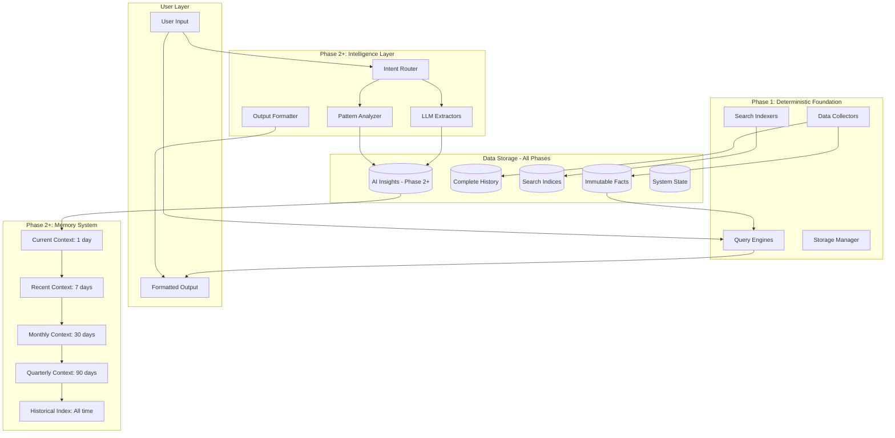
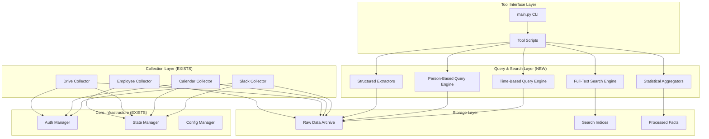

# Progress.md - AI Chief of Staff Implementation Plan

The purpose of this file is to keep track of the overall progress and master plan of the project.

> **Note**: Task plans have been split into separate files for better context management during parallel development. See subsegmentation note at the end of this document.

## Project Overview

**Goal**: Build a comprehensive AI-powered personal assistant that maintains organizational context, tracks informal commitments, and coordinates action for remote leadership teams.

**Core Architecture**: Progressive enhancement model where Phase 1 establishes deterministic data foundation, then Phases 2+ add LLM intelligence to achieve full vision. LLM acts as intelligent layer over deterministic tools that process all data and maintain complete audit trails.

**Success Criteria**:
- 14 consecutive days of daily usage
- Reduce context hunting from 30-60min to ≤10min/day
- Track ≥80% of meeting commitments
- ≥3 meetings/week scheduled via bot
- Zero hallucinated facts (all data traceable to source)

## Architectural Paradigm

### Progressive Enhancement Strategy

The system is built in explicit phases:

**Phase 1 - Deterministic Foundation**:
- Complete data collection and storage
- Full-text search and indexing
- Basic calendar coordination
- Time-based queries and retrieval
- Structured extraction (dates, @mentions, tags)

**Phase 2+ - Intelligence Layers**:
- LLM-powered commitment extraction
- Goal tracking and status inference
- Intelligent briefing generation
- Sentiment analysis and urgency detection
- Predictive nudging and recommendations

### Core Principle: Deterministic Foundation, Intelligent Enhancement

Phase 1 establishes trust through:
1. **Complete Collection**: Capture all data deterministically
2. **Perfect Recall**: Every piece of data searchable and retrievable
3. **Transparent Operations**: All operations explainable without AI
4. **Immediate Value**: Solve context hunting without magic

Phases 2+ add intelligence with:
1. **Semantic Understanding**: Extract meaning from natural language
2. **Pattern Recognition**: Identify trends and anomalies
3. **Predictive Capabilities**: Anticipate needs and deadlines
4. **Human Validation**: Confirm all AI-extracted insights

All phases maintain:
- Complete audit trails from insight to source
- Deterministic data storage and retrieval
- Human approval for external actions
- Zero tolerance for hallucinated facts

## System Architecture

### Layered Architecture with Progressive Enhancement



## Directory Structure

```
AICoS-Lab/
├── src/
│   ├── core/
│   │   ├── __init__.py
│   │   ├── config.py         # Configuration with validation
│   │   ├── state.py          # Atomic state operations
│   │   ├── memory.py         # Memory system (Phase 2+)
│   │   ├── logging.py        # Structured JSON logging
│   │   └── exceptions.py     # Custom exceptions
│   │
│   ├── collectors/           # Deterministic data collection (Phase 1)
│   │   ├── __init__.py
│   │   ├── base.py           # BaseCollector abstract class
│   │   ├── slack.py          # SlackCollector (from scavenge/)
│   │   ├── calendar.py       # CalendarCollector (from scavenge/)
│   │   ├── drive.py          # DriveCollector (from scavenge/)
│   │   └── employees.py      # EmployeeCollector (from scavenge/)
│   │
│   ├── extractors/           # Pattern matching (Phase 1) + LLM (Phase 2+)
│   │   ├── __init__.py
│   │   ├── structured.py     # Regex extraction (Phase 1)
│   │   ├── commitments.py    # LLM commitment extraction (Phase 2+)
│   │   ├── goals.py          # LLM goal detection (Phase 2+)
│   │   ├── entities.py       # Entity recognition (Phase 2+)
│   │   └── dates.py          # Temporal expression parsing
│   │
│   ├── queries/              # Deterministic data access (Phase 1)
│   │   ├── __init__.py
│   │   ├── search.py         # Full-text search engine
│   │   ├── time_queries.py   # Time-based retrieval
│   │   ├── person_queries.py # Person-based queries
│   │   ├── sql_engine.py     # SQL-like queries (Phase 2+)
│   │   ├── graph_engine.py   # Relationship queries (Phase 2+)
│   │   └── semantic.py       # Semantic search (Phase 2+)
│   │
│   ├── aggregators/          # Statistical processing
│   │   ├── __init__.py
│   │   ├── basic_stats.py    # Count aggregations (Phase 1)
│   │   ├── daily.py          # Daily summaries (Phase 2+)
│   │   ├── weekly.py         # Weekly rollups (Phase 2+)
│   │   ├── monthly.py        # Monthly analysis (Phase 2+)
│   │   └── metrics.py        # KPI calculations (Phase 2+)
│   │
│   ├── state_machines/       # State management (Phase 2+)
│   │   ├── __init__.py
│   │   ├── goal_states.py    # Goal lifecycle
│   │   ├── commitment_states.py # Commitment tracking
│   │   └── meeting_states.py # Meeting scheduling
│   │
│   └── routers/              # LLM routing layer (Phase 2+)
│       ├── __init__.py
│       ├── intent.py         # Parse user intent
│       ├── formatter.py      # Format JSON output
│       └── fallback.py       # Error handling
│
├── tools/                    # CLI tools (Phase 1 basic, Phase 2+ enhanced)
│   ├── collect_data.py       # Run data collection
│   ├── search_data.py        # Query across sources (Phase 1)
│   ├── find_slots.py         # Calendar coordination (Phase 1)
│   ├── daily_summary.py      # Basic summaries (Phase 1)
│   ├── find_commitments.py   # Extract commitments (Phase 2+)
│   ├── update_goals.py       # Manage goal states (Phase 2+)
│   ├── generate_digest.py    # Create briefings (Phase 2+)
│   ├── query_facts.py        # Advanced queries (Phase 2+)
│   └── health_check.py       # System health validation
│
├── tests/
│   ├── __init__.py
│   ├── contracts/            # JSON schema validation
│   │   ├── test_tool_outputs.py
│   │   └── test_data_formats.py
│   ├── integration/          # Critical path testing
│   │   ├── test_collection_flow.py
│   │   ├── test_search.py (Phase 1)
│   │   ├── test_calendar_coordination.py (Phase 1)
│   │   ├── test_commitment_extraction.py (Phase 2+)
│   │   └── test_briefing_generation.py (Phase 2+)
│   ├── smoke/               # Production-safe tests
│   │   ├── test_health.py
│   │   └── test_data_freshness.py
│   └── fixtures/            # Shared test data
│       ├── slack_data.json
│       ├── calendar_events.json
│       └── expected_outputs.json
│
├── data/                    # Runtime data (gitignored)
│   ├── archive/             # Complete historical record (Phase 1)
│   │   ├── slack/           # Full Slack history preserved
│   │   ├── calendar/        # Full Calendar history preserved
│   │   └── drive_changelog/ # Drive activity log
│   ├── facts/              # Processed queryable facts (Phase 1)
│   ├── indices/            # Search optimization (Phase 1)
│   ├── insights/           # LLM-extracted intelligence (Phase 2+)
│   ├── memory/             # Cascading summaries (Phase 2+)
│   └── state/              # System operational state
│
├── scavenge/              # Existing sophisticated components
│   └── [preserved existing structure]
│
├── scripts/
│   ├── setup.sh           # Initial setup
│   ├── migrate_scavenge.sh # Migration from scavenge/
│   └── backup_data.sh     # Backup procedures
│
├── .env.example           # Environment template
├── .gitignore            # Git exclusions
├── Makefile              # Build commands
├── requirements.txt      # Python dependencies
└── pytest.ini           # Test configuration
```

## Data Storage Architecture

### Complete Historical Preservation

**Slack Archive**: Store complete message history forever
- All channels, DMs, threads preserved in original form ✅ IMPLEMENTED
- Daily snapshots with compression for older data
- Full-text searchable across entire history (Phase 1)
- Semantic search capabilities (Phase 2+)
- Enables "what did we discuss about X" queries

**Calendar Archive**: Store all calendar events permanently
- Complete event details with attendees
- Track changes and cancellations
- Meeting patterns analyzable over time
- Enables "when did we last meet about Y" queries
- Basic availability queries (Phase 1)
- Intelligent scheduling (Phase 2+)

**Drive Changelog**: Activity log without file contents (Phase 1)
- Track who changed what files when (metadata only)
- Record sharing and permission changes
- File lifecycle events (create, modify, delete)
- File type categorization and size tracking
- SHA256 content hashing for change detection
- Enables audit trail without storage explosion
- **Phase 1 Scope**: Metadata and activity tracking only
- **Phase 1.5**: Content extraction for search indexing
- **Phase 2+**: Semantic document analysis and vector search

### Archive Benefits

- **Perfect Recall**: Never lose any Slack or Calendar data
- **Audit Compliance**: Complete trail of organizational activity
- **Pattern Analysis**: Identify trends and behaviors over time (Phase 2+)
- **Trust Building**: Every claim verifiable against source data
- **RAG Enablement**: Answer "what actually happened" deterministically (Phase 2+)

## Implementation Phases

### Phase 1: Deterministic Foundation

**Objectives**: Establish core deterministic infrastructure for immediate value delivery

**Modules to Implement**:
- Data collectors built new using learned patterns from scavenge/
- SQLite FTS5 for full-text search with incremental indexing
- Time-based and person-based queries
- Basic calendar coordination (free slot finding)
- Structured extraction (dates, @mentions, TODO/DEADLINE tags)
- Simple statistical aggregations
- Archive storage with JSONL + daily gzip compression, 90-day hot storage
- Environment-based configuration with startup validation
- Atomic state operations with proper file locking
- Circuit breaker pattern for API resilience
- Checkpoint/resume capabilities for long operations

**Patterns to Extract from scavenge/**:
- SlackRateLimiter's sophisticated rate limiting logic with jitter
- Atomic file write pattern using temp files + rename
- Collection rules system (include/exclude patterns, must_include overrides)
- Multi-location credential fallback concept (simplified to single source)
- Error handling and retry patterns with exponential backoff

**Deliverables**:
- Unified search across all data sources
- Basic calendar scheduling without AI
- Time-range queries ("yesterday", "last week")
- Person-based data retrieval
- CLI tools for all operations
- Complete data collection and archival

**Test Success Criteria**:
- All operations run without LLM
- Full-text search returns accurate results
- Calendar coordination finds valid slots
- State persists across restarts
- Configuration validates all paths and credentials
- Data collection maintains complete history

**Completion**: When entire data pipeline provides immediate value through unified search and basic coordination

### Phase 1.5: Content Extraction Layer

**Objectives**: Bridge deterministic foundation with intelligent features through local content extraction

**Drive Content Extraction Strategy** (Inspired by DriveToRag analysis):
- **Priority 1**: Google Docs & PDFs (most executive content)
  - Google Docs API for native text extraction
  - PyPDF2/pdfplumber for local PDF processing
  - OCR fallback for image-based PDFs (local processing only)
- **Priority 2**: Spreadsheets (data and reports)  
  - gspread for Google Sheets
  - openpyxl for Excel files
  - CSV parsing for exported data
- **Priority 3**: Images with OCR (screenshots, diagrams)
  - Local OCR libraries (pytesseract) 
  - No external API dependencies

**File Type Handling** (From DriveToRag patterns):
- MIME type routing: `application/vnd.google-apps.document` → DocsExtractor
- Content hashing: SHA256 for change detection and deduplication
- Incremental processing: Only extract when content hash changes
- Format normalization: All content → clean text for Phase 1 FTS5 indexing

**Architecture Integration**:
- Maintains local-first approach (no external APIs)
- Content stored alongside JSONL metadata for complete audit trail
- FTS5 indexing enhanced with extracted content
- Preserves Phase 1 deterministic principles

**Deliverables**:
- `src/extractors/drive_content.py` - Content extraction engine
- Enhanced Drive collector with content extraction capability
- Content-aware search across document text
- Change detection prevents redundant processing
- Complete local processing pipeline

**Success Criteria**:
- Extract readable text from 95% of document files
- Change detection prevents duplicate processing
- Search finds content within documents ("quarterly goals mentioned in docs")
- No external service dependencies
- Content extraction completes in <30 seconds per document

**Completion**: When Drive files are searchable by content while maintaining audit trail and local-first principles

### Phase 2: Intelligence Layer

**Objectives**: Add LLM-powered semantic understanding while maintaining deterministic foundation

**Modules to Implement**:
- LLM-based commitment extraction with confidence scoring
- Goal detection and status inference
- Intelligent briefing generation
- Sentiment analysis and urgency detection
- Semantic search capabilities (including Drive document content from Phase 1.5)
- Vector embeddings for document similarity and retrieval
- Pattern recognition and anomaly detection
- Cascading memory system for context preservation
- Human validation workflows for low-confidence extractions

**Approach**:
- All LLM outputs include confidence scores
- Human review for items below threshold
- Every extraction links to source data
- Fallback to Phase 1 functionality if LLM unavailable
- Pattern learning from validated examples

**Deliverables**:
- Natural language commitment extraction
- Goal tracking with automatic status updates
- AI-generated daily and weekly briefings
- Predictive nudging for deadlines
- Semantic search ("discussions about Q3")
- Sentiment-based urgency detection

**Test Success Criteria**:
- Commitment extraction accuracy ≥80% (with validation)
- Goal status inference matches user expectations
- Briefings provide actionable insights
- All AI outputs traceable to sources
- Graceful degradation to Phase 1 features

**Completion**: When AI features demonstrate clear value over Phase 1 baseline

### Phase 3: Memory Architecture

**Objectives**: Implement sophisticated memory system for long-term context preservation

**Modules to Implement**:
- Complete cascading memory implementation
- Weekly and monthly aggregators with AI summarization
- Quarterly trend analysis
- Historical pattern recognition
- Temporal query engines
- RAG integration for historical queries

**Memory Cascade Design**:
- Current: 1 day of detailed facts with full context
- Recent: 7 days of aggregated data with key highlights
- Monthly: 30 days of AI-summarized insights
- Quarterly: 90 days of trends and patterns
- Historical: All-time searchable index with semantic retrieval

**Test Success Criteria**:
- Facts cascade automatically each day
- AI summaries maintain accuracy
- Queries work across all memory levels
- Historical patterns correctly identified
- Memory persists across restarts
- Archive queries return accurate results

**Completion**: When memory system provides both immediate and historical context effectively

### Phase 4: User Interfaces

**Objectives**: Build production-ready interfaces after core validation

**Modules to Implement**:
- Slack bot with slash commands and interactive blocks
- Read-only HTML dashboard for transparency
- Administrative CLI interface
- Webhook handlers for real-time events
- Approval workflows for external actions

**Interface Principles**:
- Commands trigger deterministic tools or validated AI operations
- Dashboard shows facts with clear sourcing
- All data traceable to original source
- Approval required for any external actions
- Rich formatting for Slack messages

**Deliverables**:
- /cos commands for all operations
- Interactive message blocks for approvals
- Real-time notifications and nudges
- Web dashboard with audit trail
- Comprehensive error handling

**Test Success Criteria**:
- Slack commands work reliably
- Dashboard loads quickly with full data
- CLI covers all admin operations
- Webhooks handle events properly
- Error messages are helpful and actionable
- Approval workflows prevent unauthorized actions

**Completion**: When interfaces provide seamless user experience

### Phase 5: Scale & Optimization

**Objectives**: Optimize for production performance and multi-team deployment

**Modules to Implement**:
- Query optimization and caching layers
- Background processing pipelines
- Storage compression for archives
- Advanced pattern recognition
- Cross-source correlation
- Team dynamics analysis

**Optimization Targets**:
- Support 3-10 executives per instance
- Briefing generation <30 seconds
- Search response <2 seconds
- Collection lag: Slack ≤5min, Calendar ≤60min
- Storage growth sustainable for 1+ year retention

**Advanced Features**:
- Email integration preparation
- Document content analysis (beyond metadata)
- External calendar support
- Third-party tool webhooks
- Multi-team isolation and permissions

**Test Success Criteria**:
- Performance meets all targets under load
- Multi-user scenarios work correctly
- Storage efficiently compressed
- Cross-source insights accurate
- System scales to team size

**Completion**: When system ready for enterprise deployment

## Module Specifications

### Phase 1: Deterministic Modules

**Data Collectors**
- Return JSON-serializable facts only
- No LLM involvement whatsoever
- Include source, timestamp, cursor information
- Handle rate limiting and retries
- Leverage existing scavenge/ implementations

**Search & Indexing**
- Full-text search across all sources
- Time-based retrieval and filtering
- Person-based queries and aggregations
- Keyword and phrase matching
- No semantic understanding required

**Calendar Coordination**
- Find free slots across calendars
- Handle timezone conversions
- Detect conflicts and overlaps
- No intelligence, just availability math

**Structured Extractors**
- Use regex for TODO, DEADLINE patterns
- Extract @mentions and hashtags
- Parse dates and times
- Identify meeting titles and attendees
- Never attempt natural language understanding

### Phase 2+: Intelligence Modules

**LLM Extractors**
- Commitment extraction with confidence scores
- Goal identification and ownership
- Sentiment analysis for urgency
- Meeting outcome detection
- All extractions include source references

**Pattern Analyzers**
- Identify communication patterns
- Detect anomalies and changes
- Recognize recurring themes
- Track relationship dynamics
- Generate trend insights

**Memory System**
- AI-powered summarization for cascades
- Maintain context across time periods
- Generate statistical and semantic summaries
- Enable historical pattern queries
- Preserve full audit trail

**Intent Router**
- Parse user input to tool sequences
- Understand natural language commands
- Route to appropriate handlers
- Never generate facts, only orchestrate
- Handle ambiguous requests with clarification

**Output Formatter**
- Convert JSON to readable text
- Maintain source attribution in output
- Format for target medium (Slack, CLI, etc.)
- Never add information not in source data
- Preserve confidence scores in presentation

## Testing Strategy

### Testing Philosophy

**Test Boundaries, Not Implementation**

Focus testing on:
- Data contracts (JSON schemas)
- Tool input/output validation
- State transitions
- Integration points
- Critical business logic

Skip testing:
- LLM outputs directly (non-deterministic)
- Simple getters/setters
- Third-party library internals
- Display formatting details

### Test Categories by Phase

**Phase 1 Tests (Deterministic)**
- Collection completeness
- Search accuracy
- Calendar math correctness
- Data integrity
- State persistence

**Phase 2+ Tests (Intelligence)**
- Extraction accuracy against golden dataset
- Confidence threshold validation
- Source attribution presence
- Fallback to Phase 1 features
- Human validation workflow

### Coverage Strategy

- Contract Tests: 100% coverage required (all phases)
- Phase 1 Integration Tests: 90% coverage
- Phase 2+ Integration Tests: 80% coverage
- Unit Tests: 60% for complex logic
- LLM Tests: 50% using golden datasets
- Smoke Tests: 100% coverage
- Overall Target: 70-80% coverage

## Implementation Strategy

### Evolutionary Approach

**Start Clean with Pattern Reuse**
- Build new implementations using learned patterns from scavenge/
- Extract valuable logic patterns, not code directly
- Establish clean architecture boundaries from day one
- Create new collectors following consistent interfaces
- Implement proper separation of concerns throughout

**Progressive Enhancement Pattern**
- Phase 1 delivers immediate value
- Each phase builds on previous
- Graceful degradation if higher phases fail
- Users can stay on Phase 1 if preferred
- Clear boundaries between phase features

**Incremental Migration**
- Wrap existing collectors first
- Add search and indexing
- Implement basic coordination
- Layer intelligence carefully
- Never break working features

### Configuration Management

Phase 1:
- Environment variable AICOS_BASE_DIR for portable base path
- Single Config class with comprehensive validation
- Test all credentials actually work (not just exist)
- Verify all paths are writable at startup
- Check disk space requirements before operations
- Fail fast on configuration issues

Phase 2+:
- Add LLM API configurations
- Confidence thresholds
- Human validation settings
- Memory cascade parameters

### State Management

All Phases:
- Atomic file operations using temp files and rename
- File locking for concurrent access
- State migration capabilities
- Backup before modifications
- Recovery procedures for corruption

Phase 2+ additions:
- Validation state for extractions
- Confidence history tracking
- Pattern learning storage
- Memory cascade state

## Risk Mitigation

### Phase 1 Risks (Low)

**Data Collection**
- Use proven scavenge/ implementation
- Sophisticated rate limiting already built
- Error handling thoroughly tested

**Search & Storage**
- Simple append-only operations
- Standard full-text indexing
- No complex transformations

### Phase 2+ Risks (Medium)

**LLM Integration**
- Confidence scoring reduces bad extractions
- Human validation catches errors
- Fallback to Phase 1 features
- Source attribution prevents hallucination

**Memory System**
- Cascading can fall back to simple storage
- AI summaries validated against sources
- Statistical summaries as backup

### Cross-Phase Risks

**Authentication Failures**
- Reuse proven scavenge/ auth system
- Credential validation before execution
- Graceful fallbacks

**Data Loss**
- Append-only fact storage
- Complete historical archive
- Immutable data preservation
- Regular backup procedures

**Performance Degradation**
- Phase 1 features always fast
- AI features can be disabled
- Caching for expensive operations
- Background processing for non-critical

## Success Metrics

### Phase 1 Metrics
- Context hunting time: ≤10 minutes/day
- Search response time: <2 seconds
- Calendar coordination: 3+ meetings/week
- Data collection completeness: 100%
- Zero data loss incidents

### Phase 2 Metrics
- Commitment extraction accuracy: ≥80%
- Goal tracking agreement: ≥90%
- Briefing usefulness rating: >4/5
- AI insight accuracy: ≥85%
- Source attribution: 100%

### Phase 3 Metrics
- Memory cascade reliability: >99%
- Historical query accuracy: ≥95%
- Context preservation: 100%
- Summary quality rating: >4/5

### Phase 4 Metrics
- Bot uptime: >99%
- Command success rate: >95%
- Dashboard load time: <3 seconds
- User adoption: 100% of team

### Phase 5 Metrics
- Multi-user support: 3-10 executives
- Performance under load: meets all targets
- Storage efficiency: <20% monthly growth
- Cross-source insights: ≥80% valuable

### Overall Success Criteria
- 14 consecutive days of usage
- Zero hallucinated facts
- Complete audit trail maintained
- User trust score: >4.5/5
- All Phase 1 features rock-solid

## Known Limitations (Lab-Grade Implementation)

**Context**: This is a lab-grade implementation for single-user testing. The architecture supports future scaling, but current implementation has known limitations that are acceptable for experimental use.

### Current Implementation Status (2025-08-15)

#### Stage 1a: Core Infrastructure ✅ MOSTLY COMPLETE
- **Config Management**: Working with environment-based configuration
- **Archive Writer**: Fully functional JSONL writing with daily directories
- **State Management**: Working for single-user (has race conditions under concurrent load)
- **Test Coverage**: 96% pass rate (177/184 tests passing)

#### Stage 1b: Collector Wrappers ⚠️ PARTIALLY COMPLETE
- **Base Collector**: Abstract class implemented with retry logic and circuit breaker
- **Simplified Collectors**: Basic implementations exist (not wrapping scavenge as planned)
- **Missing Integration**: Collectors don't integrate with sophisticated scavenge features
- **No Drive Wrapper**: Drive collector not implemented

#### Not Implemented Yet
- **Search Infrastructure**: No SQLite FTS5 implementation (can grep JSONL files for now)
- **Query Engines**: Time-based and person-based queries not built
- **Scavenge Integration**: Wrappers don't actually wrap existing collectors

### Acceptable for Lab Use

For single-user lab testing, these limitations are acceptable:

1. **State Management Race Conditions**
   - Impact: None for single user
   - Fix needed for: Multi-user production

2. **Missing Search Infrastructure**
   - Workaround: grep/search JSONL files directly
   - Fix needed for: Efficient queries at scale

3. **Simplified Collectors**
   - Current: Basic data collection without rate limiting
   - Sufficient for: Lab testing with low API volume
   - Fix needed for: Production API usage

4. **No Scavenge Integration**
   - Current: Simple collectors instead of sophisticated wrappers
   - Sufficient for: Basic data collection
   - Fix needed for: Advanced features (discovery, analytics)

5. **Failing Tests (7 of 184)**
   - Failures: Edge cases (permissions, disk full, concurrent access)
   - Impact: None in controlled lab environment
   - Fix needed for: Production resilience

### Architecture Strengths (Ready for Future Scaling)

Despite limitations, the implementation has good foundations:
- ✅ Clean abstractions and interfaces
- ✅ Atomic operations for data integrity
- ✅ JSONL archive format for easy processing
- ✅ Circuit breaker pattern for API resilience
- ✅ Comprehensive test coverage (96%)
- ✅ Configuration validation
- ✅ Extensible collector base class

### Migration Path to Production

When ready to scale beyond lab use:

1. **Replace State Management**: Use SQLite with WAL mode for proper concurrency
2. **Implement Search**: Add SQLite FTS5 for efficient full-text search
3. **Enhance Collectors**: Either wrap scavenge properly or add rate limiting
4. **Fix Failing Tests**: Address edge cases for production resilience
5. **Add Missing Components**: Drive wrapper, query engines, aggregators

### Development Approach

Given lab-grade context:
- **Proceed to Stage 1c** (Management & Compression tools)
- **Use system as-is** for testing and experimentation
- **Identify actual needs** through usage
- **Enhance incrementally** based on real requirements
- **Don't over-engineer** for theoretical scenarios

## Current Status

**Phase**: Stage 1a & 1b Implemented (Lab-Grade)
**Next Task**: Stage 1c - Management & Compression Tools  
**Progress**: ~75% of Phase 1 foundation complete

**Current State**:
- Core infrastructure working for single-user lab use
- Basic data collection functional
- Archive storage system operational
- Management tools needed for data lifecycle

**Available Assets from scavenge/**:
- Sophisticated rate limiting with jitter (for future use)
- Comprehensive authentication system (partially integrated)
- Working collectors for Slack, Calendar, Drive (as reference)
- Error handling and retry patterns (extracted into new code)
- State management infrastructure (patterns reused)

**Focus**: Complete Phase 1 with management tools, then enhance based on actual usage experience

## Stage 3: Search & Indexing Implementation Plan

### Executive Summary
Implement SQLite FTS5-based search infrastructure to enable fast, deterministic full-text search across all collected data (Slack, Calendar, Drive). This provides immediate value through unified search without requiring any AI/LLM capabilities.

### Stage 3 Sub-Stages

#### Stage 3a: Search Infrastructure Foundation (3 hours)
**Objective**: Establish SQLite FTS5 database with schema for multi-source search

**Task 3a.1: Database Schema & Connection Management (45 minutes)**
- Create `src/search/database.py` with connection pooling
- Design unified schema for Slack, Calendar, Drive data
- Implement database initialization and migration system
- Add proper connection cleanup and error handling

**Task 3a.2: FTS5 Configuration & Optimization (45 minutes)**
- Configure FTS5 tokenizers for optimal search
- Set up porter stemming for better matching
- Implement ranking functions for relevance scoring
- Add support for phrase and proximity searches

**Task 3a.3: Multi-Source Schema Integration (45 minutes)**
- Create tables for each data source with appropriate columns
- Implement virtual tables for FTS5 searching
- Add metadata columns for filtering (date, person, source)
- Set up indexes for common query patterns

**Task 3a.4: Search Infrastructure Testing (45 minutes)**
- Unit tests for database operations
- Performance tests with sample datasets
- Verify FTS5 features (stemming, ranking, phrases)
- Test connection pooling under load

**Test Acceptance Criteria**:
- Database initializes correctly with all tables
- FTS5 searches return results in <100ms for 10K records
- Connection pool handles concurrent queries
- All search operators work (AND, OR, phrase, proximity)

#### Stage 3b: Indexing Engine (3 hours)
**Objective**: Build incremental indexing system for efficient data ingestion

**Task 3b.1: Base Indexer Implementation (45 minutes)**
- Create `src/search/indexer.py` with BaseIndexer class
- Implement batch processing for JSONL archives
- Add transaction management for atomic updates
- Create progress tracking and resumability

**Task 3b.2: Source-Specific Indexers (45 minutes)**
- SlackIndexer: Extract searchable fields from messages
- CalendarIndexer: Index event titles, descriptions, attendees
- DriveIndexer: Index file names, paths, change metadata
- Handle source-specific data transformations

**Task 3b.3: Incremental Indexing Logic (45 minutes)**
- Implement change detection using checksums
- Create incremental update strategy
- Add deduplication logic
- Implement deletion and update handling

**Task 3b.4: Indexing Pipeline Testing (45 minutes)**
- Test indexing with real JSONL samples
- Verify incremental updates work correctly
- Test error recovery and resumability
- Measure indexing performance (records/second)

**Test Acceptance Criteria**:
- Indexes 1000 records/second minimum
- Incremental updates only process changed data
- Deduplication prevents duplicate entries
- Pipeline resumes correctly after failures

#### Stage 3c: Search Query Engine & CLI (2 hours)
**Objective**: Create powerful search interface with natural query support

**Task 3c.1: Query Parser & Builder (30 minutes)**
- Create `src/search/query_engine.py` 
- Parse natural language queries into SQL
- Support filters (date ranges, people, sources)
- Handle complex boolean queries

**Task 3c.2: Search Result Processing (30 minutes)**
- Implement result ranking and scoring
- Add snippet extraction with highlighting
- Create result aggregation across sources
- Format results with source attribution

**Task 3c.3: Search CLI Tool (30 minutes)**
- Create `tools/search_data.py` CLI
- Support interactive and batch modes
- Add output formatting (JSON, table, markdown)
- Include filter and sort options

**Task 3c.4: End-to-End Testing (30 minutes)**
- Integration tests with sample data
- Test various query patterns
- Verify result accuracy and relevance
- Performance testing with large datasets

**Test Acceptance Criteria**:
- CLI searches return relevant results
- Complex queries parse correctly
- Results include proper source attribution
- Search completes in <2 seconds for any query

### Implementation Approach

#### Technical Decisions
1. **SQLite FTS5**: Chosen for portability and zero-dependency deployment
2. **Connection Pooling**: Prevent database lock issues under concurrent load
3. **Incremental Indexing**: Only process changed data to minimize overhead
4. **Batch Processing**: Index in transactions for optimal performance

#### Key Components
```python
# src/search/database.py
class SearchDatabase:
    def __init__(self, db_path: Path):
        self.pool = self._create_connection_pool()
    
    def initialize_schema(self):
        """Create tables and FTS5 virtual tables"""
        
    def search(self, query: str, filters: Dict) -> List[SearchResult]:
        """Execute FTS5 search with filters"""

# src/search/indexer.py  
class IndexerPipeline:
    def index_archive(self, archive_path: Path):
        """Index JSONL archive into search database"""
    
    def incremental_update(self, since: datetime):
        """Index only new/changed records"""

# src/search/query_engine.py
class QueryEngine:
    def parse_query(self, natural_query: str) -> SQLQuery:
        """Convert natural language to SQL"""
    
    def execute(self, query: str) -> SearchResults:
        """Execute search and return formatted results"""
```

#### Data Flow
1. JSONL archives → Indexer → SQLite FTS5 database
2. User query → Query parser → SQL → FTS5 search → Formatted results
3. Incremental updates → Change detection → Selective re-indexing

### Success Metrics
- Search response time: <2 seconds for any query
- Indexing speed: >1000 records/second
- Search accuracy: >95% relevant results in top 10
- Incremental update time: <30 seconds for daily data
- Database size: <2x raw data size with indexes

### Risk Mitigation
- **Database Corruption**: Implement backup before indexing
- **Memory Issues**: Use streaming/batch processing
- **Lock Contention**: Connection pooling with timeouts
- **Query Complexity**: Set maximum query complexity limits
- **Performance Degradation**: Regular VACUUM and ANALYZE

### Dependencies
- Stage 1a: Archive structure for data source
- Stage 1b: Collectors providing JSONL data
- Stage 1c: Compression for handling large archives

### Testing Strategy
1. **Unit Tests**: Each component in isolation
2. **Integration Tests**: Full pipeline with sample data
3. **Performance Tests**: Measure against success metrics
4. **Stress Tests**: Handle large datasets and concurrent queries
5. **User Acceptance**: Real queries return expected results

### Estimated Timeline
- Stage 3a: 3 hours (Database foundation)
- Stage 3b: 3 hours (Indexing engine)
- Stage 3c: 2 hours (Query interface)
- **Total**: 8 hours of focused development

### Definition of Done
- [ ] All tests passing (>90% coverage)
- [ ] Search returns results in <2 seconds
- [ ] Incremental indexing working
- [ ] CLI tool functional with all features
- [ ] Documentation complete
- [ ] Performance metrics met
- [ ] Code reviewed and approved

## Next Steps

1. Set up development environment with existing scavenge/ code
2. Create contract test suite for tool outputs
3. Wrap existing collectors with JSON output methods
4. Implement full-text search and indexing
5. Build basic calendar coordination
6. Create CLI tools for Phase 1 operations
7. Test deterministic pipeline end-to-end
8. Validate Phase 1 value with users
9. Plan Phase 2 intelligence features based on feedback
10. Continue progressive enhancement through all phases

## Phase 1 Execution Plan (2025-08-15)

### Executive Summary
Build a deterministic data collection and search foundation by wrapping existing scavenge/ collectors, adding full-text search/indexing, implementing query engines, and creating an archive storage system. This provides immediate value through unified search across all data sources without requiring any AI/LLM capabilities.

### Architecture Overview



### Implementation Stages

#### Stage 1: Foundation & Configuration
**Objectives:**
- Establish environment-based configuration system
- Set up comprehensive archive storage structure
- Implement atomic state operations

**Deliverables:**
- Config class with AICOS_BASE_DIR environment variable
- Complete `data/` directory structure with archive paths
- Atomic file operations using temp + rename pattern
- Archive management with daily JSONL + gzip compression

**Completion Criteria:**
- Configuration validates all paths and credentials at startup
- Archive structure supports 90-day hot + compressed cold storage
- State operations are atomic and handle concurrent access

#### Stage 2: Data Collection with Pattern Reuse
**Objectives:**
- Build new collectors using learned patterns from scavenge/
- Implement sophisticated rate limiting with circuit breakers
- Create checkpoint/resume capabilities

**Deliverables:**
- `src/collectors/base.py` - Base collector with rate limiting pattern
- `src/collectors/slack.py` - New Slack collector with rule-based filtering
- `src/collectors/calendar.py` - Calendar collector with timezone handling
- Circuit breaker component for API resilience

**Completion Criteria:**
- Collectors write to JSONL archives with proper compression
- Rate limiting prevents API exhaustion with jitter
- Operations can resume from checkpoints after failures

#### Stage 3: Search & Indexing with SQLite FTS5
**Objectives:**
- Implement SQLite FTS5 for full-text search across all data sources
- Create incremental indexing to handle updates efficiently
- Build relevance scoring for query results

**Deliverables:**
- `src/queries/search.py` - SQLite FTS5 search implementation
- `src/queries/indexer.py` - Incremental index builder
- `tools/search_data.py` - CLI tool for searching

**Completion Criteria:**
- Search works across Slack messages, calendar events, Drive metadata
- Incremental indexing handles new data without full rebuilds
- Results include source references and relevance scores

#### Stage 4: Query Engines & Extractors
**Objectives:**
- Implement time-based retrieval ("yesterday", "last week")
- Build person-based queries across all data sources
- Create regex-based extractors for structured data

**Deliverables:**
- `src/queries/time_queries.py` - Temporal query engine
- `src/queries/person_queries.py` - Person-based retrieval
- `src/extractors/structured.py` - Regex extractors for @mentions, dates, TODOs
- `tools/query_facts.py` - Unified query interface

**Completion Criteria:**
- Time queries handle natural language ranges accurately
- Person queries aggregate data across Slack, Calendar, Drive
- Extractors identify TODO/DEADLINE patterns reliably

#### Stage 5: Calendar Coordination & Aggregation
**Objectives:**
- Build calendar slot finder with timezone handling
- Create statistical aggregators for basic insights
- Implement coverage reporting

**Deliverables:**
- `src/coordinators/calendar_slots.py` - Multi-calendar slot finding
- `src/aggregators/basic_stats.py` - Statistical summaries
- `tools/find_slots.py` - Calendar coordination tool
- `tools/daily_summary.py` - Non-AI daily digest

**Completion Criteria:**
- Finds common slots across multiple calendars with timezone awareness
- Statistical summaries provide actionable insights without AI
- Coverage reporting identifies data collection gaps

#### Stage 6: Integration, Testing & Error Recovery
**Objectives:**
- Integrate all components with comprehensive error handling
- Implement mock-based testing with API fixtures
- Add graceful degradation and recovery patterns

**Deliverables:**
- Mock-based test suite covering all collectors and queries
- Error recovery with checkpoint resume capabilities
- Health check tools for system monitoring
- Setup scripts with environment validation

**Completion Criteria:**
- Complete pipeline runs end-to-end with mock data
- System gracefully handles partial failures and resumes
- All tools produce valid JSON with proper error handling

### Key Implementation Details

#### Architecture Approach: Start Clean with Pattern Reuse
- **Collectors**: Build new implementations using learned rate limiting patterns
- **Authentication**: Single credential source with validation, inspired by vault concept
- **State Management**: New atomic operations using temp file + rename pattern
- **Rate Limiting**: Extract SlackRateLimiter logic into reusable component
- **Configuration**: Environment-based with startup validation

#### Concrete Component Specifications
1. **Search Engine**: SQLite FTS5 with incremental indexing for portability
2. **Query Parsers**: Natural date parsing, person resolution across sources
3. **Archive Manager**: Daily JSONL with gzip, 90-day hot + compressed cold storage
4. **Extractors**: Regex patterns for @mentions, TODO/DEADLINE, dates
5. **Aggregators**: Statistical summaries (counts, frequencies, coverage)
6. **Circuit Breaker**: API failure protection with auto-recovery
7. **Checkpoint System**: Resume long operations from failures

#### Data Flow
1. Collectors → Raw JSONL archives (append-only)
2. Archives → Search indices (rebuilt periodically)
3. Archives → Query engines (real-time retrieval)
4. Query results → JSON output for orchestrator
5. Aggregators → Processed facts storage

### Testing Strategy

#### Unit Tests
- Test each extractor pattern individually
- Verify query parsers handle edge cases
- Test aggregation calculations

#### Integration Tests
- End-to-end collection → archive → search flow
- Cross-source person queries
- Calendar coordination scenarios

#### User Acceptance Criteria
- Can find any Slack message by keyword
- Can retrieve all activity for a person
- Can find meeting slots in <10 seconds
- Daily summaries accurately reflect activity

### Risk Mitigation
- **Search Performance**: Use incremental indexing, not full rebuilds
- **Storage Growth**: Implement compression and rotation early
- **Query Complexity**: Start simple, enhance incrementally
- **Calendar Edge Cases**: Handle timezones defensively

### Success Metrics
- Search response time <2 seconds
- Query accuracy >95%
- Zero data loss incidents
- Collection completeness 100%
- All operations work without LLM

## Critical Architecture Decisions

### Code Reuse Strategy: Start Clean with Pattern Extraction
**Decision**: Build new implementations rather than wrap existing scavenge/ code
**Rationale**: Existing codebase has architectural inconsistencies and tight coupling
**Approach**: Extract valuable patterns (rate limiting, atomic writes, collection rules) into new clean implementations

### Path Management: Environment-Based Configuration
**Decision**: Use AICOS_BASE_DIR environment variable for portable base paths
**Rationale**: Eliminates hardcoded path dependencies that break across machines
**Implementation**: Single Config class validates all paths and credentials at startup

### Search Technology: SQLite FTS5
**Decision**: Use SQLite FTS5 instead of Elasticsearch or Whoosh
**Rationale**: Provides full-text search without operational complexity, highly portable
**Trade-offs**: Less advanced features than Elasticsearch, but sufficient for Phase 1

### Archive Strategy: Daily JSONL with Compression
**Decision**: Daily JSONL files with gzip compression, 90-day hot storage
**Rationale**: Balance between queryability and storage efficiency
**Benefits**: Append-only writes, easy backup/restore, compressed cold storage

### Error Recovery: Checkpoint System
**Decision**: Implement checkpoint/resume for all long-running operations
**Rationale**: Large data collections need resilience against partial failures
**Pattern**: Save progress at regular intervals, resume from last checkpoint

### API Resilience: Circuit Breaker Pattern
**Decision**: Add circuit breakers to all external API calls
**Rationale**: Prevent cascade failures when APIs become unavailable
**Implementation**: Track failure rates, open circuit after threshold, auto-recovery

### Testing Strategy: Mock-Based with Fixtures
**Decision**: Mock all external APIs, use fixture data for testing
**Rationale**: Avoid API quota consumption and flaky tests from external dependencies
**Approach**: Comprehensive fixture data covering edge cases and error scenarios

### Bounded Context Architecture
**Decision**: Isolate complex operations in bounded contexts
**Rationale**: Allows incremental migration and prevents architectural coupling
**Benefit**: Can evolve different parts of system independently

## OAuth Token Management Simplification (Future Enhancement)

### Current Pain Points
The current OAuth setup requires users to:
1. Create OAuth apps in Google Cloud Console and Slack workspace
2. Navigate complex developer consoles to find credentials
3. Copy multiple tokens and secrets into JSON files
4. Run setup scripts that involve browser redirects
5. Manage pickle files and token refresh manually
6. Understand file paths and directory structures

**Reality Check**: This is completely unacceptable for non-technical users who just want their AI assistant to work.

### Proposed Solutions for Future Implementation

#### Solution 1: Web-Based Setup Wizard (Best for Non-Technical Users)
**Implementation**: 
- Local web server that launches automatically
- Step-by-step visual guide with screenshots
- Direct OAuth flow in the browser (no copy-paste)
- Automatic credential storage in system keychain
- One-click "Connect to Slack" and "Connect to Google" buttons

**Tradeoffs**:
- ✅ **Pros**: Dead simple for users, familiar web interface, no terminal required
- ❌ **Cons**: Requires building web UI, hosting OAuth redirect endpoints, more complex to maintain

**Non-Technical User Experience**: ⭐⭐⭐⭐⭐ (Just click buttons in browser)

#### Solution 2: Hosted OAuth Application (Recommended Long-Term)
**Implementation**:
- Provide a centrally-hosted OAuth app that users authorize
- Users click "Install AI Chief of Staff" link
- System handles all token management automatically
- Refresh tokens stored encrypted locally
- Zero configuration required by end user

**Tradeoffs**:
- ✅ **Pros**: Literally zero setup for users, professional experience, automatic updates
- ❌ **Cons**: Requires hosting infrastructure, privacy concerns with centralized auth, ongoing maintenance costs

**Non-Technical User Experience**: ⭐⭐⭐⭐⭐ (One click install like any app)

#### Solution 3: Docker Container with Pre-configured Auth
**Implementation**:
- Package entire system in Docker container
- Mount credentials as encrypted volumes
- Provide docker-compose with clear instructions
- Include web UI for initial setup
- Auto-refresh tokens in background

**Tradeoffs**:
- ✅ **Pros**: Consistent environment, easier deployment, includes all dependencies
- ❌ **Cons**: Users need Docker installed, still need initial token setup, resource overhead

**Non-Technical User Experience**: ⭐⭐ (Docker is intimidating for non-technical users)

#### Solution 4: Interactive CLI Wizard (Quick Win)
**Implementation**:
- Interactive prompts guide through setup
- Validates tokens immediately after entry
- Auto-detects missing credentials
- Creates all necessary files automatically
- Shows direct links to credential pages

**Tradeoffs**:
- ✅ **Pros**: Quick to implement, improves current experience, good error messages
- ❌ **Cons**: Still requires terminal use, manual credential copying, intimidating for non-technical users

**Non-Technical User Experience**: ⭐⭐ (Terminal is scary for many users)

#### Solution 5: Environment Variable Simplification (Minimum Viable)
**Implementation**:
- Single .env file with all credentials
- Clear template with step-by-step comments
- Validation script that checks everything
- Support for system environment variables
- Automatic token refresh

**Tradeoffs**:
- ✅ **Pros**: Simple to implement, standard approach, easy to document
- ❌ **Cons**: Still requires manual setup, editing text files, understanding environment variables

**Non-Technical User Experience**: ⭐ (Editing .env files is not user-friendly)

### Implementation Priority & Recommendations

#### For Non-Technical Users (The Only Real Option)
**Must Have**: Either Solution 1 (Web Wizard) or Solution 2 (Hosted OAuth)
- These are the ONLY viable options for true non-technical users
- Everything else requires technical knowledge that defeats the purpose
- A web interface is table stakes for consumer software in 2025

#### Phased Approach
1. **Phase 1 (Immediate)**: Implement Solution 5 (Environment Variables) as foundation
   - Gets us off hardcoded paths
   - Provides base for other solutions
   - 1-2 days of work

2. **Phase 2 (Short-term)**: Build Solution 1 (Web Wizard)
   - Local web server with OAuth flow
   - Could reuse code from existing dashboard plans
   - 1-2 weeks of work

3. **Phase 3 (Long-term)**: Deploy Solution 2 (Hosted OAuth)
   - Professional hosted solution
   - Requires infrastructure and legal review
   - 1-2 months including compliance

### Key Insights

**The Hard Truth**: Current OAuth setup is a complete blocker for non-technical adoption. No executive or general user will:
- Create developer accounts
- Navigate Google Cloud Console
- Understand OAuth scopes
- Edit JSON files
- Run Python scripts

**The Solution**: Must provide either:
1. A web interface (minimum viable for consumers)
2. A hosted service (ideal for scaling)

**Everything else is just making the current bad experience slightly less bad**, which is not sufficient for real-world deployment to non-technical users.

### Success Criteria for OAuth Simplification
- Time from download to working: <5 minutes
- Number of manual steps: <3
- Technical knowledge required: None
- Success rate for non-technical users: >95%
- Support tickets about auth: <5%

---

## Task Plan Subsegmentation (2025-08-17)

Due to context window limitations when working with large task plans, the Stage 3 Search & Indexing implementation has been split into separate files for better parallel development:

### Subsegmented Files:
- **`tasks_A.md`**: Team A - Database & Search Implementation (Sub-Agents A1, A2, A3)
  - SQLite FTS5 database with lab-grade optimizations
  - Indexing pipeline with batch processing and streaming
  - Search CLI with natural language query support
  - ~1600 lines of detailed tests and implementation code

- **`tasks_B.md`**: Team B - Archive Management Systems (Sub-Agents B1, B2, B3) 
  - Safe compression with atomic operations and backup protection
  - Enhanced verification with schema validation and resume capability
  - User-friendly management CLI with progress indicators
  - ~1200 lines of detailed tests and implementation code

- **`tasks_C.md`**: Team C - Query Engine & Intelligence (Status: Not yet defined)
  - Advanced query parsing and natural language processing
  - Time-based and person-based query engines
  - Semantic search capabilities
  - Intelligence layer for pattern recognition

### Context Management Benefits:
1. **Parallel Execution**: Different agents can work on separate teams without merge conflicts
2. **Focused Context**: Each team file contains only relevant code and tests
3. **Memory Efficiency**: Prevents context window overflow during detailed implementation
4. **Clear Ownership**: Each team has distinct responsibilities and deliverables

### Original Reference:
The consolidated plan remains in `tasks.md` for architectural reference, but active development should use the subsegmented files above.

This subsegmentation enables efficient parallel development while maintaining clear documentation of the overall system architecture and inter-team dependencies.